# AI Planet — Expense Reimbursement & Travel Settlement

> A production-oriented MERN/TypeScript take-home project that converts messy travel evidence into an auditable, policy-aware reimbursement workflow — from raw evidence to employee claim, business approvals, Finance review, and payment tracking.

## Project Links

| Resource                  | Link                                                                                                   |
| ------------------------- | ------------------------------------------------------------------------------------------------------ |
| 🚀 **Live Application**   | [https://ai-planet-client.vercel.app/](https://ai-planet-client.vercel.app/)                           |
| 📚 **Swagger / API Docs** | [https://ai-planet-server.vercel.app/docs/](https://ai-planet-server.vercel.app/docs/)                 |
| ❤️ **API Readiness**      | [https://ai-planet-server.vercel.app/ready](https://ai-planet-server.vercel.app/ready)                 |
| 📄 **OpenAPI JSON**       | [https://ai-planet-server.vercel.app/openapi.json](https://ai-planet-server.vercel.app/openapi.json)   |
| 💻 **GitHub Repository**  | [https://github.com/akshaychavan23031998/AI-Planet](https://github.com/akshaychavan23031998/AI-Planet) |
| 👨‍💻 **Author Portfolio**   | [https://akshay-chavan-portfolio.vercel.app/](https://akshay-chavan-portfolio.vercel.app/)             |
| 🧑‍💻 **GitHub Profile**     | [https://github.com/akshaychavan23031998](https://github.com/akshaychavan23031998)                     |

> **About the author:** Visit [Akshay Chavan's portfolio](https://akshay-chavan-portfolio.vercel.app/) to explore more projects, see professional experience, contact me, or download my latest resume.

---

## Start Here — 60-Second Mental Model

The project solves one core problem:

> **How do we convert fragmented travel evidence into a reimbursement decision without losing traceability or inventing missing facts?**

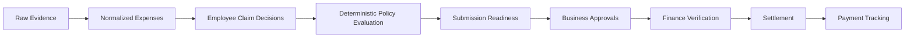

The entire system is built around four rules:

1. **Preserve source truth.** Evidence and normalized source expenses are never silently rewritten by claim actions.
2. **Keep financial decisions deterministic.** Policy, settlement, approval routing, authorization, and payment eligibility are backend-controlled.
3. **Require humans where evidence is ambiguous.** Missing facts are surfaced rather than fabricated.
4. **Make workflow changes auditable and concurrency-safe.** Claim review history, workflow history, Finance metadata, review cycles, and workflow versions are explicit.

---

## Table of Contents

- [1. Product Overview](#1-product-overview)
- [2. Business Problem](#2-business-problem)
- [3. Canonical Demo Scenario](#3-canonical-demo-scenario)
- [4. Product Roles](#4-product-roles)
- [5. System Architecture](#5-system-architecture)
- [6. Request Flow](#6-request-flow)
- [7. Technology Stack](#7-technology-stack)
- [8. Repository Structure](#8-repository-structure)
- [9. Domain and Database Design](#9-domain-and-database-design)
- [10. Evidence and Data Integrity](#10-evidence-and-data-integrity)
- [11. Policy Engine](#11-policy-engine)
- [12. Human-in-the-Loop Resolution](#12-human-in-the-loop-resolution)
- [13. Claim Workflow](#13-claim-workflow)
- [14. Approval Routing](#14-approval-routing)
- [15. Finance and Settlement](#15-finance-and-settlement)
- [16. Concurrency and Race-Condition Protection](#16-concurrency-and-race-condition-protection)
- [17. Authorization and Trust Model](#17-authorization-and-trust-model)
- [18. Frontend Architecture](#18-frontend-architecture)
- [19. API Design](#19-api-design)
- [20. Error Handling](#20-error-handling)
- [21. Engineering Conventions](#21-engineering-conventions)
- [22. Source of Truth](#22-source-of-truth)
- [23. Local Development Setup](#23-local-development-setup)
- [24. Environment Variables](#24-environment-variables)
- [25. Database Seeding and Reset](#25-database-seeding-and-reset)
- [26. Running the Application](#26-running-the-application)
- [27. Swagger and OpenAPI](#27-swagger-and-openapi)
- [28. Demo Personas](#28-demo-personas)
- [29. Recommended Demo Walkthrough](#29-recommended-demo-walkthrough)
- [30. Testing Strategy](#30-testing-strategy)
- [31. Deployment Architecture](#31-deployment-architecture)
- [32. Production Deployment Notes](#32-production-deployment-notes)
- [33. Production Smoke Test](#33-production-smoke-test)
- [34. Security Considerations](#34-security-considerations)
- [35. Assumptions and Limitations](#35-assumptions-and-limitations)
- [36. AI / LLM Decision](#36-ai--llm-decision)
- [37. Engineering Decision Summary](#37-engineering-decision-summary)
- [38. How to Extend the Project](#38-how-to-extend-the-project)
- [39. Troubleshooting](#39-troubleshooting)
- [40. Future Production Enhancements](#40-future-production-enhancements)
- [41. Author](#41-author)

---

# 1. Product Overview

AI Planet is an internal-style employee travel expense reimbursement and settlement application.

It converts fragmented travel information from sources such as:

- travel-request emails
- approval emails
- flight tickets
- hotel booking vouchers
- hotel invoices
- cab receipts
- failed-payment messages
- duplicate receipts
- colleague-forwarded receipts
- meal / entertainment bills
- employee hierarchy data
- company expense policy

into a structured claim that can be reviewed by an employee, routed through the correct business approvers, verified by Finance, and tracked through settlement.

The project is intentionally built as a **production-oriented engineering demonstration**, not as a simple CRUD application.

Its main engineering concerns are:

- evidence traceability
- deterministic financial calculations
- human review of ambiguity
- backend authorization
- workflow correctness
- concurrency safety
- API contract quality
- frontend/server state separation
- deployment readiness
- auditability

The core product principle is:

> **Never fabricate certainty where the source evidence is incomplete.**

---

# 2. Business Problem

Expense reimbursement is difficult when evidence, policy, hierarchy, and payment responsibility are scattered across unrelated documents.

Typical failure modes include:

- duplicate reimbursement
- company-paid expenses reimbursed to the employee again
- failed payments treated as successful expenses
- missing or ambiguous receipts
- expense ownership mistakes
- disallowed subcomponents hidden inside a larger invoice
- wrong approval routing
- missing historical approvals
- inconsistent calculations
- stale approval decisions
- weak audit trails
- simultaneous reviewers overwriting one another

The application separates each concern into a clear layer.

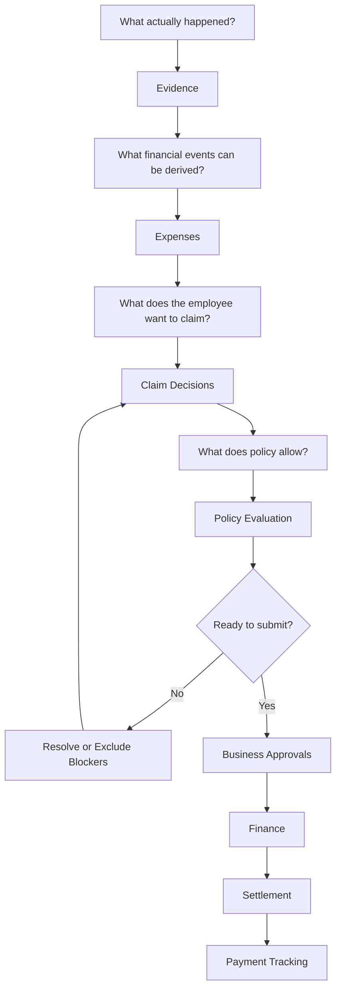

---

# 3. Canonical Demo Scenario

The seeded scenario follows **Chaitanya Reddy (`NX-4471`)** on a Pune → Bengaluru → Pune business trip in June 2026.

## Source-backed facts

| Item                       | Fact                        |
| -------------------------- | --------------------------- |
| Employee                   | Chaitanya Reddy             |
| Employee code              | `NX-4471`                   |
| Route                      | Pune → Bengaluru → Pune     |
| Travel request window      | 16–20 June 2026             |
| Estimated spend            | ₹48,000                     |
| Travel advance             | ₹20,000                     |
| Flights                    | Company-paid                |
| Hotel                      | Employee-paid final invoice |
| Historical RM approval     | Present                     |
| Historical HOD approval    | Not proven                  |
| Actual Travel Request ID   | Unknown                     |
| Settlement submission date | Not supplied                |
| Planned hotel nights       | 4                           |
| Hotel invoice nights       | 3                           |

## Why this is intentionally messy

The scenario includes:

- a failed Uber payment followed by a successful payment
- a duplicate Uber receipt
- a receipt belonging to another employee
- marketing / promotional noise
- company-paid flights
- a hotel invoice containing both allowed and disallowed components
- mixed hotel tax that cannot be uniquely allocated from source evidence
- a business dinner with insufficient attendee / approval evidence
- incomplete historical pre-travel approval proof

These records are not removed just because they make the scenario harder.

They remain visible because **traceability is more important than making the claim look clean**.

## Hotel example

The final hotel invoice is ₹21,504:

| Component |      Amount |
| --------- | ----------: |
| Room      |     ₹17,250 |
| Laundry   |        ₹450 |
| Minibar   |        ₹380 |
| Dining    |      ₹1,120 |
| Taxes     |      ₹2,304 |
| **Total** | **₹21,504** |

The room is ₹5,750/night over 3 nights, below the Tier-1 lodging cap of ₹6,000/night excluding tax.

Laundry and minibar are disallowed.

The tax is intentionally unresolved until reviewed because the source invoice does not prove a unique reimbursable-vs-disallowed tax allocation.

---

# 4. Product Roles

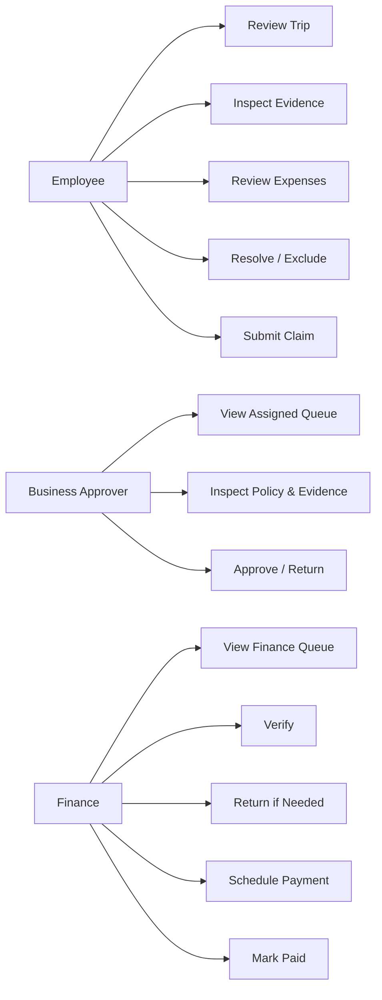

## Employee

The employee can:

- view their trip
- inspect source evidence
- inspect normalized expenses
- see policy findings
- see eligible, disallowed, excluded, and unresolved amounts
- exclude an item
- restore an item
- resolve supported ambiguity
- check readiness
- view settlement
- submit
- correct a returned claim
- resubmit

## Business approver

Assigned approvers can:

- see claims currently assigned to them
- inspect claim context and evidence
- inspect policy findings and settlement
- inspect workflow history
- approve
- return with remarks

## Finance

Authorized Finance users can:

- view the Finance queue
- inspect approved claims
- verify Finance review
- return a claim
- schedule reimbursement when settlement is payable
- record completed payment
- preserve Finance/payment audit history

---

# 5. System Architecture

The project intentionally uses a simple full-stack architecture instead of premature microservices.

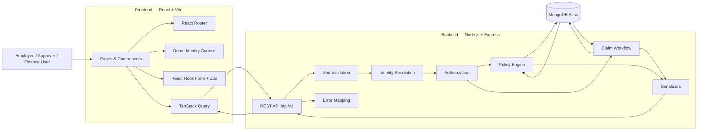

## Architectural ownership

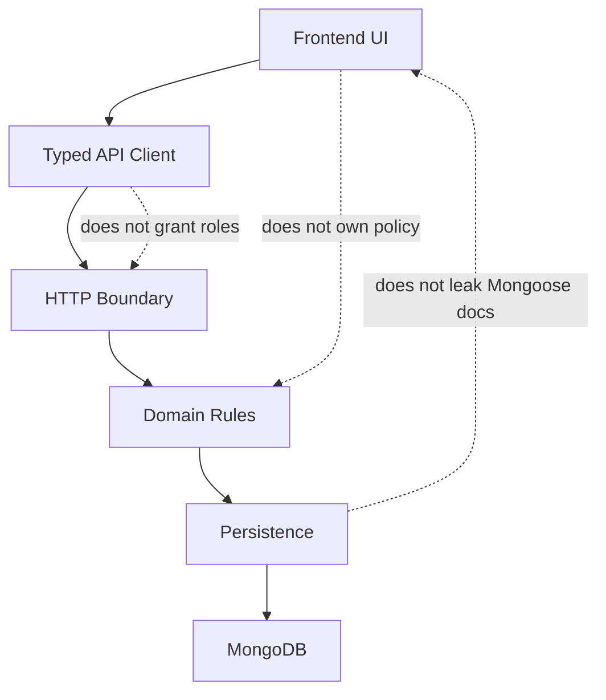

### Frontend owns

- presentation
- routing
- user interaction
- local UI state
- server-state caching
- forms
- display formatting

### Backend owns

- identity resolution
- authorization
- policy
- settlement
- approval routing
- workflow transitions
- concurrency protection
- persistence
- public API contracts

### MongoDB owns

- durable domain state
- source evidence
- normalized expenses
- employee hierarchy
- Claim review decisions
- approval/Finance workflow state

---

# 6. Request Flow

## Read request

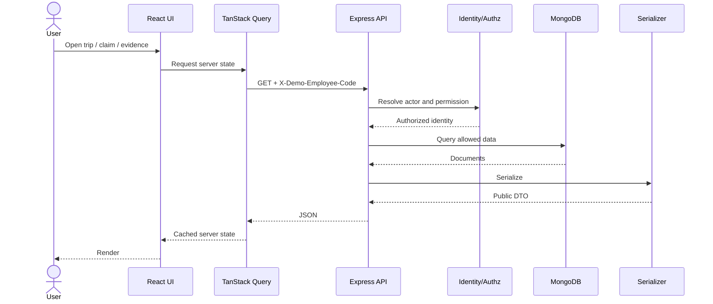

## Financial mutation

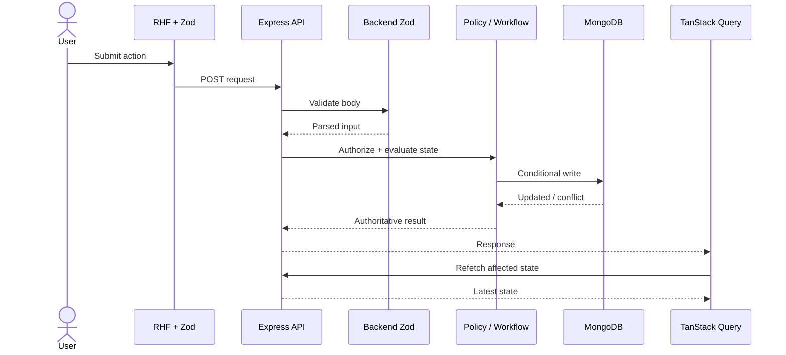

The client never decides that a financial mutation succeeded based only on local optimistic state.

---

# 7. Technology Stack

## Frontend

| Technology        | Responsibility                |
| ----------------- | ----------------------------- |
| React             | UI                            |
| TypeScript        | Static typing                 |
| Vite              | Development/build tooling     |
| React Router      | Client-side routing           |
| TanStack Query    | Server-state fetching/caching |
| React Hook Form   | Form state                    |
| Zod               | Client validation             |
| Native `fetch`    | HTTP client                   |
| CSS Modules       | Scoped styling                |
| Shared CSS tokens | Design consistency            |
| Lucide React      | Icons                         |
| Sonner            | Notifications                 |
| Vitest            | Frontend tests                |
| Testing Library   | UI behavior tests             |
| jsdom             | Browser-like test environment |

## Backend

| Technology               | Responsibility                 |
| ------------------------ | ------------------------------ |
| Node.js                  | Runtime                        |
| Express                  | HTTP API                       |
| TypeScript               | Static typing                  |
| MongoDB Atlas            | Persistent database            |
| Mongoose                 | ODM                            |
| Zod                      | Environment/request validation |
| Pino / pino-http         | Structured logging             |
| Mailparser               | Email source parsing           |
| csv-parse                | Employee CSV parsing           |
| OpenAPI 3.0.3            | API contract                   |
| Swagger UI               | Interactive API documentation  |
| Supertest                | API integration tests          |
| Node test runner + `tsx` | Backend tests                  |

---

# 8. Repository Structure

```text
AI-Planet/
│
├── client/
│   ├── src/
│   │   ├── api/          # Typed browser API calls
│   │   ├── app/          # Router, query client, query hooks
│   │   ├── components/   # Reusable UI
│   │   ├── context/      # Demo identity context
│   │   ├── pages/        # Route-level pages
│   │   ├── styles/
│   │   ├── test/
│   │   └── utils/
│   ├── .env.example
│   ├── package.json
│   ├── vite.config.ts
│   └── vercel.json
│
├── server/
│   ├── src/
│   │   ├── api/v1/       # HTTP boundary
│   │   ├── domain/
│   │   │   ├── policy/   # Financial/policy rules
│   │   │   └── claims/   # Workflow/approvals/Finance
│   │   ├── modules/      # Mongoose models
│   │   ├── openapi/      # OpenAPI + contract tests
│   │   ├── seed/         # Deterministic pack import
│   │   ├── app.ts
│   │   ├── database.ts
│   │   ├── env.ts
│   │   ├── errorHandler.ts
│   │   └── server.ts
│   ├── .env.example
│   ├── package.json
│   ├── tsconfig.json
│   └── vercel.json
│
├── docs/
│   └── canonical-assignment-data.md
│
├── package.json
├── package-lock.json
└── README.md
```

## Directory responsibilities

| Directory                           | Responsibility                                                 |
| ----------------------------------- | -------------------------------------------------------------- |
| `client/src/api`                    | Typed browser API calls                                        |
| `client/src/app`                    | Query hooks, router, server-state behavior                     |
| `client/src/components`             | Reusable presentation and interaction                          |
| `client/src/context`                | Small app-wide demo identity state                             |
| `client/src/pages`                  | Route-level compositions                                       |
| `server/src/api/v1`                 | Routes, identity, validation, query orchestration, serializers |
| `server/src/domain/policy`          | Pure deterministic policy/financial evaluation                 |
| `server/src/domain/claims`          | Claim workflow, approvals, Finance, concurrency                |
| `server/src/modules`                | Mongoose persistence models                                    |
| `server/src/openapi`                | OpenAPI contract and tests                                     |
| `server/src/seed`                   | Deterministic assignment-pack import                           |
| `docs/canonical-assignment-data.md` | Frozen source interpretation                                   |

---

# 9. Domain and Database Design

The application persists five major business areas.

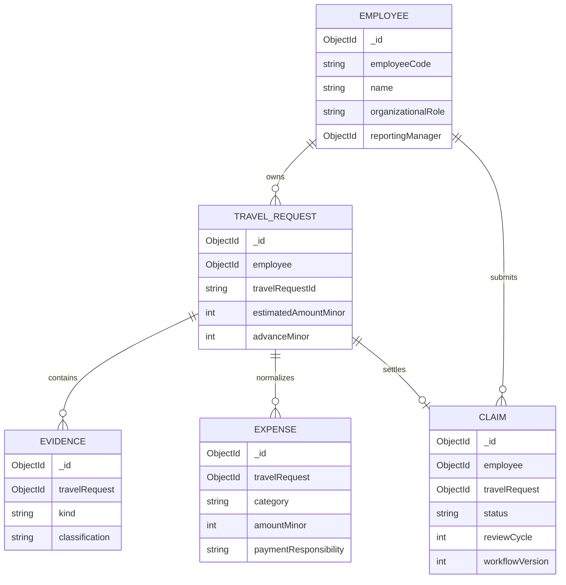

## Why these five areas?

1. **Employees** — identity and organization hierarchy.
2. **Travel Requests** — pre-travel context.
3. **Evidence** — source truth.
4. **Expenses** — normalized financial events.
5. **Claims** — employee review decisions and workflow.

Approvals and Finance are embedded within the Claim because they are lifecycle state for that Claim rather than independent domain aggregates in this assignment.

## Important modeling rules

### MongoDB ObjectIds

MongoDB ObjectIds are internal document identity.

They are **not** the business Travel Request ID.

The real Travel Request ID is absent from the supplied source, so the application leaves it unknown rather than using a fabricated example ID.

### Money

All backend money is integer **paise**.

```text
₹1,415.02
→ 141502
```

### Business dates

Date-only facts use:

```text
YYYY-MM-DD
```

Timestamps use actual date-time semantics.

### Source immutability

Employee review actions do not rewrite original Evidence or normalized Expense records.

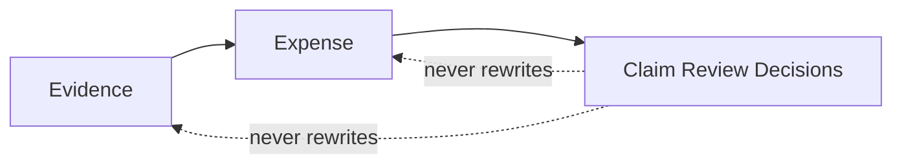

---

# 10. Evidence and Data Integrity

The application deliberately preserves inconvenient evidence.

## Duplicate receipt

Both the canonical receipt and duplicate evidence remain visible.

The duplicate must not create a second reimbursement.

## Failed payment

A failed payment remains in Evidence because it explains the later successful transaction.

It is not reimbursable itself.

## Claimant mismatch

A receipt belonging to another employee remains visible but cannot silently become the claimant's expense.

## Company-paid flight

Flights remain visible as travel cost and audit evidence, but employee reimbursement is zero.

## Missing information

The system does not invent:

- HOD approval
- dinner attendee names
- Travel Request ID
- settlement submission date
- mixed tax allocation
- employee-vs-company estimate split needed to prove advance-cap compliance

---

# 11. Policy Engine

The backend policy engine is authoritative.

Main location:

```text
server/src/domain/policy/
```

It evaluates:

- proof requirements
- employee-paid vs company-paid responsibility
- duplicates
- failed payments
- lodging limits
- disallowed hotel components
- hotel dining
- mixed hotel tax
- meal / entertainment rules
- historical travel approvals
- claim approval thresholds
- advance assessment
- settlement
- submission readiness

## Evaluation flow

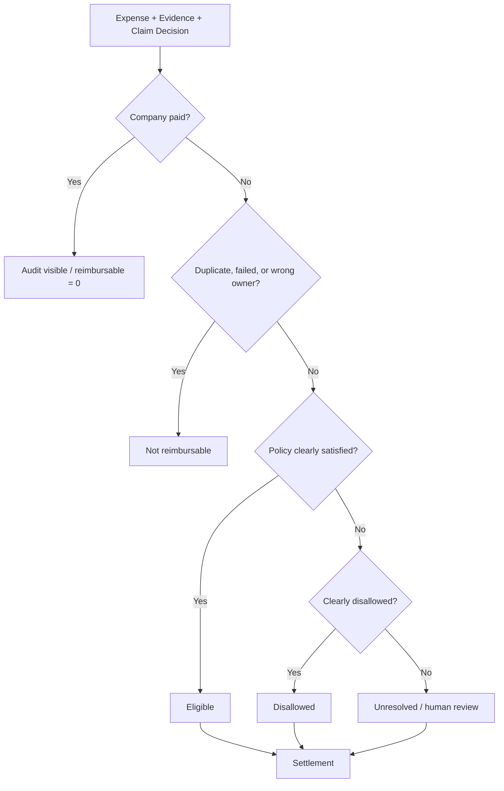

## Provisional vs final settlement

The engine distinguishes:

```text
eligible
disallowed
excluded
unresolved
```

If an included amount is unresolved:

```text
payableMinor = null
recoverableMinor = null
```

The UI therefore shows an unresolved settlement instead of pretending the final result is ₹0.

---

# 12. Human-in-the-Loop Resolution

The project does not use automation to manufacture missing facts.

A representative example is hotel tax.

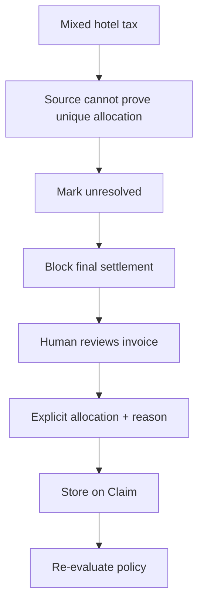

The source invoice remains unchanged.

The manual decision belongs to the Claim and is auditable.

---

# 13. Claim Workflow

Persistent states are exactly:

```text
DRAFT
MANAGER_REVIEW
HOD_REVIEW
DIVISION_REVIEW
MD_REVIEW
FINANCE_REVIEW
RETURNED
PAYMENT_SCHEDULED
PAID
```

`SUBMITTED` and `RESUBMITTED` are workflow events, not persistent statuses.


Not every Claim passes through every approval state.

The backend determines the route.

---

# 14. Approval Routing

There are two separate approval concepts.

## Pre-travel Travel Request approval

Uses the **estimated pre-travel spend**.

For this scenario:

```text
₹48,000
```

That falls into the RM + HOD band.

The source proves the Reporting Manager approval, but HOD approval is not proven.

That remains a visible historical policy issue.

## Settlement Claim approval

Uses the actual Claim amount under policy.

The frontend does not reproduce threshold logic.

|               Amount | Required business approval                       |
| -------------------: | ------------------------------------------------ |
|        Up to ₹25,000 | Reporting Manager                                |
|    ₹25,001 – ₹75,000 | Reporting Manager + HOD                          |
|  ₹75,001 – ₹2,00,000 | Reporting Manager + HOD + Division Head          |
|      Above ₹2,00,000 | Reporting Manager + HOD + Division Head + MD/CEO |
| International travel | MD/CEO also required                             |
|    Every final Claim | Finance review required                          |

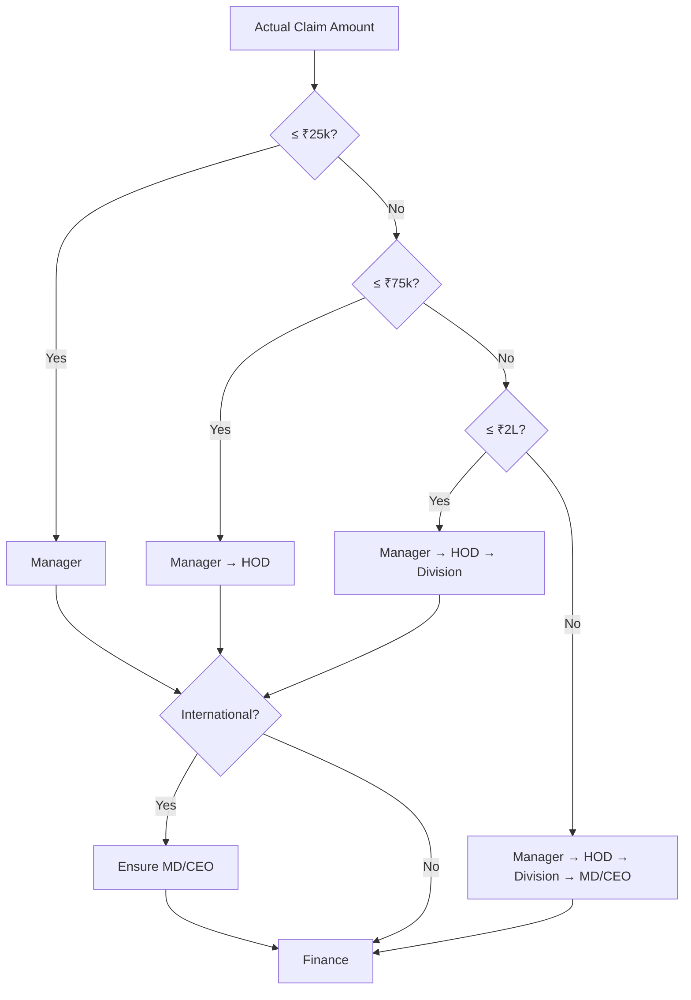

---

# 15. Finance and Settlement

Finance is mandatory.

The settlement model separates:

- employee-paid
- company-paid
- eligible
- disallowed
- excluded
- unresolved
- advance
- payable
- recoverable

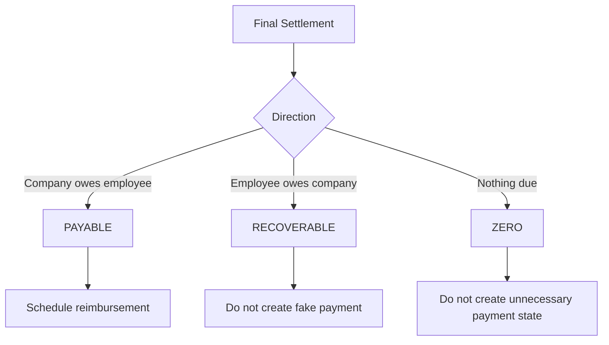

## Finance verification

Verification records Finance review for the current cycle.

It does not automatically mean payment.

## Payment scheduling

Payable settlements can be scheduled for supported payment-run dates:

```text
10th
25th
```

The date cannot be in the past.

## Mark paid

Requires:

- payable settlement
- scheduled payment
- scheduled date reached
- non-empty payment reference

No real bank/payroll integration is performed.

---

# 16. Concurrency and Race-Condition Protection

Workflow writes use optimistic concurrency.

Mutations validate expected state such as:

```text
Claim ID
claimant
status
review cycle
workflow version
```

The Claim maintains:

```text
workflowVersion
```

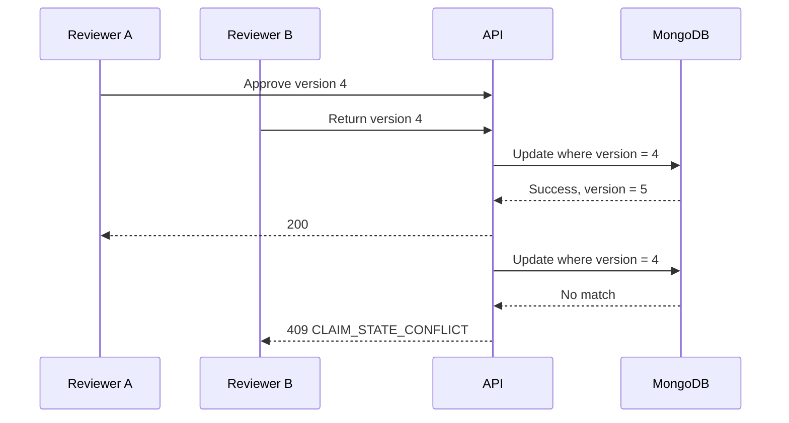

The second reviewer must refetch.

This prevents silent lost updates without introducing distributed locking.

The Claim also stores a review-input fingerprint so approvals cannot silently apply to materially changed financial/evidence input.

---

# 17. Authorization and Trust Model

This assignment uses deliberate **demo impersonation**, not production authentication.

The browser sends:

```http
X-Demo-Employee-Code: NX-4471
```

It does **not** send an authoritative role.

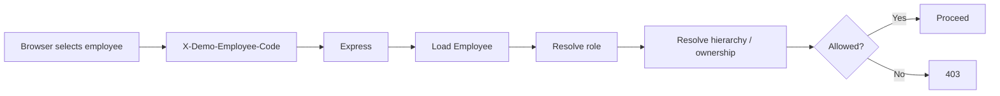

The backend determines:

- role
- claimant ownership
- exact approver
- manager hierarchy
- Finance permissions
- self-approval restrictions

A production replacement would use SSO/OIDC/session/JWT identity while preserving similar backend authorization.

---

# 18. Frontend Architecture

The frontend avoids unnecessary global state.

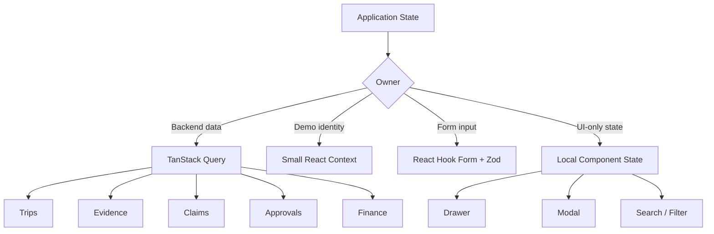

## React Router

Main routes:

```text
/
/trips/:travelRequestId
/trips/:travelRequestId/evidence
/claims/:claimId
/approvals
/finance
```

## Actor-scoped query cache

Protected query keys include the employee code.

```text
actor
  / NX-4471
  / claim
  / <claimId>
```

This prevents cached data from one persona being reused for another.

## Mutations

Financial/workflow mutations are not automatically retried.

The UI does not optimistically invent:

- statuses
- settlements
- approvals
- Finance state

It refetches authoritative server state.

---

# 19. API Design

Base:

```text
/api/v1
```

## Public operational/documentation endpoints

```http
GET /health
GET /ready
GET /openapi.json
GET /docs
GET /api/v1/demo/users
```

## Protected routes

Require:

```http
X-Demo-Employee-Code
```

### Travel Requests

```http
GET /api/v1/travel-requests
GET /api/v1/travel-requests/:travelRequestId
```

### Evidence

```http
GET /api/v1/travel-requests/:travelRequestId/evidence
GET /api/v1/evidence/:evidenceId
```

### Expenses

```http
GET /api/v1/travel-requests/:travelRequestId/expenses
```

### Claims

```http
GET /api/v1/claims
GET /api/v1/claims/:claimId
GET /api/v1/claims/:claimId/validation
GET /api/v1/claims/:claimId/readiness
GET /api/v1/claims/:claimId/settlement
```

### Employee review actions

```http
POST /api/v1/claims/:claimId/expenses/:expenseId/exclude
POST /api/v1/claims/:claimId/expenses/:expenseId/restore
POST /api/v1/claims/:claimId/expenses/:expenseId/resolve
POST /api/v1/claims/:claimId/submit
POST /api/v1/claims/:claimId/resubmit
```

### Approvals

```http
GET  /api/v1/approvals
POST /api/v1/claims/:claimId/approve
POST /api/v1/claims/:claimId/return
```

### Finance

```http
GET  /api/v1/finance/claims
POST /api/v1/claims/:claimId/finance/verify
POST /api/v1/claims/:claimId/finance/schedule-payment
POST /api/v1/claims/:claimId/finance/mark-paid
```

## Response convention

Single resource:

```json
{
  "data": {}
}
```

Collection:

```json
{
  "data": [],
  "meta": {
    "count": 0
  }
}
```

Error:

```json
{
  "error": {
    "code": "ERROR_CODE",
    "message": "Human readable message",
    "details": {}
  }
}
```

---

# 20. Error Handling

|  HTTP | Meaning                                |
| ----: | -------------------------------------- |
| `400` | Invalid request / validation           |
| `401` | Missing or invalid demo identity       |
| `403` | Authorization denied                   |
| `404` | Resource not found                     |
| `409` | Workflow/concurrent-state conflict     |
| `422` | Valid request blocked by policy/domain |
| `500` | Unexpected server error                |

Important domain errors:

```text
POLICY_NOT_READY
CLAIM_STATE_CONFLICT
INVALID_MANUAL_RESOLUTION
RETURN_REMARKS_REQUIRED
INVALID_PAYMENT_DATE
PAYMENT_REFERENCE_REQUIRED
ACTION_NOT_ALLOWED
```

Unexpected database/driver details and credentials are not exposed to clients.

---

# 21. Engineering Conventions

## Backend

Routes remain thin:

```text
parse
→ resolve identity
→ authorize
→ call domain/query logic
→ serialize
```

Policy logic belongs under:

```text
server/src/domain/
```

Mongoose documents are serialized into explicit HTTP shapes rather than leaked directly.

## Frontend

- TanStack Query owns server state.
- Context owns only selected demo identity.
- React Hook Form + Zod own substantive forms.
- Local UI state stays local.
- Components format financial values but do not become a second policy engine.
- Workflow mutations refetch authoritative state.

## Money

Backend:

```text
integer paise
```

UI:

```text
formatted INR
```

## Dates

Business date:

```text
YYYY-MM-DD
```

Timestamp:

```text
date-time
```

## Styling

```text
CSS Modules
+
shared design tokens
```

## Accessibility

Important interaction requirements include:

- semantic HTML
- keyboard access
- labelled controls
- focus visibility
- Escape handling
- status text beyond color alone
- useful empty/error states

## Logging

Pino / pino-http records operational request metadata while routine logging avoids sensitive headers, bodies, and query values.

---

# 22. Source of Truth

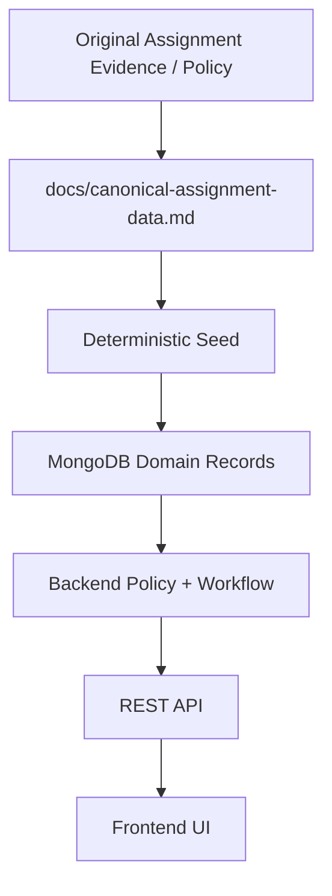

The UI is never the authoritative source of financial truth.

---

# 23. Local Development Setup

## Prerequisites

- Node.js **22.20+**
- npm
- Git
- MongoDB Atlas

For fresh source-backed seeding, the original assignment pack is also required.

```bash
node --version
npm --version
git --version
```

## Clone

```bash
git clone https://github.com/akshaychavan23031998/AI-Planet.git
cd AI-Planet
```

## Install

```bash
npm install
```

The repository uses npm workspaces:

```text
client
server
```

## Backend config

Create:

```text
server/.env
```

from:

```text
server/.env.example
```

Example:

```env
NODE_ENV=development
PORT=3000
CLIENT_ORIGIN=http://localhost:5173
MONGODB_URI=mongodb+srv://<username>:<password>@<cluster-host>/
MONGODB_DB_NAME=ai_planet_expense
```

Never commit `server/.env`.

## Frontend config

Create `client/.env` only when you want to override the default API origin.

```env
VITE_API_BASE_URL=http://localhost:3000
```

`VITE_*` variables are public browser configuration.

---

# 24. Environment Variables

## Server

| Variable          | Required     | Secret  | Purpose                  |
| ----------------- | ------------ | ------- | ------------------------ |
| `MONGODB_URI`     | Yes          | **Yes** | MongoDB Atlas connection |
| `MONGODB_DB_NAME` | Yes          | No      | Logical DB name          |
| `NODE_ENV`        | No           | No      | Runtime mode             |
| `PORT`            | Local server | No      | Local Express port       |
| `CLIENT_ORIGIN`   | Yes          | No      | Exact frontend origin    |

Recommended DB:

```text
ai_planet_expense
```

## Client

| Variable            | Required        | Secret | Purpose               |
| ------------------- | --------------- | ------ | --------------------- |
| `VITE_API_BASE_URL` | Production: Yes | **No** | Public backend origin |

---

# 25. Database Seeding and Reset

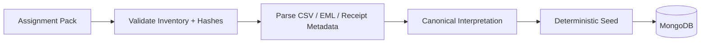

PowerShell:

```powershell
$env:ASSIGNMENT_PACK_PATH="<path-to-assignment-pack>"
npm run seed
Remove-Item Env:ASSIGNMENT_PACK_PATH
```

Expected canonical dataset:

```text
9 Employees
1 TravelRequest
17 Evidence
14 Expenses
1 Claim
```

The importer:

- validates source inventory
- validates pinned hashes
- parses employee CSV
- parses email metadata/content
- uses canonical receipt metadata
- creates deterministic records
- reuses seeded identities
- restores canonical seeded source/default claim state when rerun

Canonical Claim start:

```text
DRAFT
reviewCycle = 0
no business approvals
no workflow events
no Finance state
no employee review decisions
```

---

# 26. Running the Application

Run both:

```bash
npm run dev
```

Local URLs:

| Service   | URL                                  |
| --------- | ------------------------------------ |
| Frontend  | `http://localhost:5173`              |
| Backend   | `http://localhost:3000`              |
| Swagger   | `http://localhost:3000/docs`         |
| OpenAPI   | `http://localhost:3000/openapi.json` |
| Health    | `http://localhost:3000/health`       |
| Readiness | `http://localhost:3000/ready`        |

Run separately:

```bash
npm run dev:server
npm run dev:client
```

Production-style build:

```bash
npm run build
```

Compiled backend:

```bash
npm run start --workspace server
```

Frontend preview:

```bash
npm run preview --workspace client
```

---

# 27. Swagger and OpenAPI

Production Swagger:

[https://ai-planet-server.vercel.app/docs/](https://ai-planet-server.vercel.app/docs/)

Production OpenAPI:

[https://ai-planet-server.vercel.app/openapi.json](https://ai-planet-server.vercel.app/openapi.json)

Local Swagger:

```text
http://localhost:3000/docs
```

## Swagger authorization

Click **Authorize** and enter, for example:

```text
NX-4471
```

Swagger sends:

```http
X-Demo-Employee-Code: NX-4471
```

Production Swagger uses pinned browser assets while continuing to consume the same application-owned `/openapi.json` contract.

---

# 28. Demo Personas

| Employee Code | Person          | Demo role                          |
| ------------- | --------------- | ---------------------------------- |
| `NX-4471`     | Chaitanya Reddy | Claimant                           |
| `NX-2210`     | Suresh Iyer     | Reporting Manager                  |
| `NX-1108`     | Meera Krishnan  | Head of Department                 |
| `NX-1002`     | Arvind Rao      | Head of Division                   |
| `NX-1000`     | Nandita Shah    | Managing Director                  |
| `NX-3305`     | Ravi Menon      | Finance                            |
| `NX-3300`     | Kavitha Balan   | Finance                            |
| `NX-5182`     | Deepa Nair      | Unrelated employee / receipt owner |
| `NX-4490`     | Imran Qureshi   | Employee with no supplied trip     |

A persona without a seeded TravelRequest does not receive fake trip, evidence, or claim IDs.

---

# 29. Recommended Demo Walkthrough

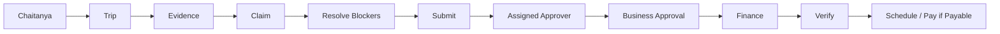

1. Select **Chaitanya Reddy — NX-4471**.
2. Open Overview, Trip, Evidence, and Claim.
3. Inspect the failed payment, duplicate receipt, colleague receipt, company-paid flights, hotel components, dinner, settlement, and readiness.
4. Resolve supported ambiguity or exclude unsupported items without fabricating evidence.
5. Submit once backend readiness becomes true.
6. Switch to the exact assigned approver, beginning with **Suresh Iyer** when Manager review is required.
7. Continue through any further business approval stages.
8. Switch to Ravi or Kavitha for Finance.
9. Verify, schedule payment if payable, and mark paid only when valid.
10. Rerun the deterministic seed after destructive demos if the canonical state must be restored.

---

# 30. Testing Strategy

```mermaid
flowchart TD
    P["Policy Tests"] --> C["Confidence"]
    W["Workflow Tests"] --> C
    A["API Integration Tests"] --> C
    O["OpenAPI Contract Tests"] --> C
    F["Frontend Tests"] --> C
    S["Seed Tests"] --> C
```

## Current regular baseline

```text
332 passing tests
```

Suite distribution:

```text
57  policy
55  workflow
44  API
12  OpenAPI
164 client
```

Source-backed seed suite:

```text
3 passing tests
```

Commands:

```bash
npm test
npm run test:policy
npm run test:workflow
npm run test:api
npm run test:openapi
npm run test:client
```

Seed validation:

```powershell
$env:ASSIGNMENT_PACK_PATH="<path-to-assignment-pack>"
npm run test:seed
Remove-Item Env:ASSIGNMENT_PACK_PATH
```

Quality gate:

```bash
npm run lint
npm run typecheck
npm run build
npm run format:check
npm test
git diff --check
```

---

# 31. Deployment Architecture

```mermaid
flowchart LR
    GitHub["GitHub Repository"]

    subgraph Vercel["Vercel"]
        Client["ai-planet-client\nRoot: client"]
        Server["ai-planet-server\nRoot: server"]
    end

    Atlas[("MongoDB Atlas")]

    GitHub --> Client
    GitHub --> Server
    Client --> Server
    Server --> Atlas
```

Production URLs:

| Service   | URL                                                                                                  |
| --------- | ---------------------------------------------------------------------------------------------------- |
| Frontend  | [https://ai-planet-client.vercel.app/](https://ai-planet-client.vercel.app/)                         |
| Readiness | [https://ai-planet-server.vercel.app/ready](https://ai-planet-server.vercel.app/ready)               |
| Swagger   | [https://ai-planet-server.vercel.app/docs/](https://ai-planet-server.vercel.app/docs/)               |
| OpenAPI   | [https://ai-planet-server.vercel.app/openapi.json](https://ai-planet-server.vercel.app/openapi.json) |

---

# 32. Production Deployment Notes

## Frontend Vercel project

```text
Project: ai-planet-client
Root Directory: client
Framework: Vite
Install Command: cd .. && npm install
Build Command: npm run build
Output Directory: dist
```

Production env:

```env
VITE_API_BASE_URL=https://ai-planet-server.vercel.app
```

The frontend includes an SPA rewrite so nested React Router routes survive direct refresh.

## Backend Vercel project

```text
Project: ai-planet-server
Root Directory: server
Framework: Express
Install Command: cd .. && npm install --include=dev
Build Command: npm run build
```

Production env:

```env
NODE_ENV=production
CLIENT_ORIGIN=https://ai-planet-client.vercel.app
MONGODB_URI=<atlas-connection-string>
MONGODB_DB_NAME=ai_planet_expense
```

The Express application is exported for Vercel's runtime.

Local development continues to use the normal server listener startup path.

## Frontend/backend environment handshake

```mermaid
sequenceDiagram
    participant Client as Frontend
    participant Server as Backend
    participant Atlas as MongoDB Atlas

    Note over Client: VITE_API_BASE_URL = backend origin
    Note over Server: CLIENT_ORIGIN = frontend origin
    Client->>Server: Browser API request
    Server->>Server: Exact-origin CORS
    Server->>Atlas: Connect / reuse connection
    Atlas-->>Server: Data
    Server-->>Client: JSON
```

## Atlas network access

For this take-home deployment, Atlas must allow the Vercel backend's outbound traffic.

If `0.0.0.0/0` is used for the demo, compensate with:

- strong credentials
- least-privilege database user
- secrets stored only in backend deployment settings

A real enterprise deployment should prefer stronger network controls.

---

# 33. Production Smoke Test

Backend:

```text
GET /health
GET /ready
GET /openapi.json
GET /docs/
GET /api/v1/demo/users
```

Expected:

```text
/health → 200
/ready  → 200, database connected
/demo/users → 9 users
```

Frontend:

```text
/
/trips/:travelRequestId
/trips/:travelRequestId/evidence
/claims/:claimId
/approvals
/finance
```

Verify direct navigation and refresh.

Verify persona switching:

```text
Chaitanya
→ Suresh
→ Meera
→ Ravi/Kavitha
→ Imran
```

does not leak cached protected state.

---

# 34. Security Considerations

## Secrets

Secrets belong only in backend environment configuration.

Never put secrets in:

```text
VITE_*
```

## CORS

Production uses the exact frontend origin:

```env
CLIENT_ORIGIN=https://ai-planet-client.vercel.app
```

Wildcard CORS is intentionally avoided.

## Authorization

The backend independently verifies:

- claimant
- role
- exact approver
- hierarchy
- Finance access
- self-approval restrictions
- workflow state

## Financial integrity

Policy, settlement, routing, and payment eligibility are backend-authoritative.

## Source integrity

Claim actions do not modify original Evidence/Expense meaning.

## Concurrency

Conditional writes protect against stale simultaneous updates.

## Logging

Internal database connection information is not returned to clients.

---

# 35. Assumptions and Limitations

- Demo identity is not production authentication.
- The supplied assignment scenario is the primary canonical dataset.
- There is no live OCR.
- There is no Gmail/Outlook integration.
- There is no real bank/payroll integration.
- Receipt evidence is modeled through source metadata/relationships rather than a general file-storage platform.
- There are no notifications.
- The canonical settlement is INR-focused.
- Submission-within-7-days compliance cannot be concluded because the authoritative submission date is missing.
- Advance-cap compliance cannot be concluded because the authoritative estimated employee-paid/company-paid split is missing.
- The application intentionally leaves those facts unknown rather than inventing conclusions.

---

# 36. AI / LLM Decision

The application deliberately does **not** use an LLM for authoritative financial decisions.

These remain deterministic:

```text
Policy
Eligibility
Disallowances
Settlement
Approval Routing
Workflow Transitions
Authorization
Payment Eligibility
```

```mermaid
flowchart LR
    A["Probabilistic AI Output"] --> B{"Authoritative money decision?"}
    B -- "Yes" --> C["Do not use AI"]
    B -- "No" --> D["Potential advisory use"]
    D --> E["Summaries"]
    D --> F["Policy explanations"]
    D --> G["Category suggestions"]
    D --> H["Missing-info hints"]
    D --> I["Duplicate candidates"]
```

AI could be added later for advisory assistance, but deterministic validation should remain the final authority.

---

# 37. Engineering Decision Summary

| Decision                          | Reason                                                    |
| --------------------------------- | --------------------------------------------------------- |
| Monorepo `client` + `server`      | Simple development with independent deployments           |
| React SPA                         | Appropriate for internal workflow UI                      |
| Express REST API                  | Clear HTTP/domain boundary                                |
| MongoDB + Mongoose                | Flexible document-oriented workflow persistence           |
| Five major persisted domain areas | Keeps model aligned to business concepts                  |
| Approvals + Finance inside Claim  | They belong to Claim lifecycle                            |
| Integer paise                     | Financial precision                                       |
| `YYYY-MM-DD` business dates       | Avoid date-only timezone bugs                             |
| Deterministic policy engine       | Predictable financial decisions                           |
| Immutable source meaning          | Auditability                                              |
| Claim-local review decisions      | Preserve source truth                                     |
| Demo employee header              | Demonstrate personas without pretending to have real auth |
| Backend role resolution           | Browser cannot grant privileges                           |
| Conditional writes                | Race-condition protection                                 |
| Workflow version                  | Detect stale updates                                      |
| Actor-scoped query keys           | Prevent persona cache leakage                             |
| TanStack Query                    | Server-state ownership/invalidation                       |
| RHF + Zod                         | Consistent forms                                          |
| Explicit serializers              | Prevent persistence internals leaking                     |
| Centralized errors                | Safe, consistent API failures                             |
| OpenAPI + Swagger                 | Discoverable/testable API contract                        |
| Exact-origin CORS                 | Avoid wildcard production access                          |
| No runtime LLM decisions          | Financial determinism                                     |
| Two Vercel projects               | Independent frontend/backend deployment                   |
| Deterministic seed                | Repeatable demo and testing                               |

## Where should new code live?

```mermaid
flowchart TD
    A["New Requirement"] --> B{"Financial / policy?"}
    B -- "Yes" --> P["server/src/domain/policy"]
    B -- "No" --> C{"Workflow / approval / Finance?"}
    C -- "Yes" --> W["server/src/domain/claims"]
    C -- "No" --> D{"Persistence?"}
    D -- "Yes" --> M["server/src/modules"]
    D -- "No" --> E{"HTTP boundary?"}
    E -- "Yes" --> API["server/src/api/v1"]
    E -- "No" --> F{"API documentation?"}
    F -- "Yes" --> O["server/src/openapi"]
    F -- "No" --> G{"Server state in UI?"}
    G -- "Yes" --> Q["client/src/api + client/src/app"]
    G -- "No" --> U["client/src/components + pages"]
```

---

# 38. How to Extend the Project

Typical feature sequence:

```text
1. Define/extend domain behavior.
2. Add domain tests.
3. Add persistence changes if required.
4. Add Zod validation.
5. Add/extend API route.
6. Add serializer.
7. Update OpenAPI contract/tests.
8. Add typed frontend API call.
9. Add actor-scoped TanStack Query hook.
10. Add UI.
11. Add frontend tests.
12. Run full regression.
```

This keeps business rules out of controllers and UI components.

---

# 39. Troubleshooting

## `/ready` returns 503

Check:

```text
MONGODB_URI
MONGODB_DB_NAME
Atlas Network Access
Atlas database-user credentials
```

`/health` can still return 200 because liveness and readiness are intentionally separate.

## Browser shows CORS error

Local:

```env
CLIENT_ORIGIN=http://localhost:5173
```

Production:

```env
CLIENT_ORIGIN=https://ai-planet-client.vercel.app
```

## Frontend cannot reach API

Local:

```env
VITE_API_BASE_URL=http://localhost:3000
```

Production:

```env
VITE_API_BASE_URL=https://ai-planet-server.vercel.app
```

Vite env values are build-time, so redeploy after changing production values.

## Persona has no Trip / Evidence / Claim

That employee may have no seeded TravelRequest.

For example, Imran intentionally has no supplied trip.

The system does not invent IDs.

## Claim cannot be submitted

Inspect:

```text
Policy Findings
Submission Readiness
Unresolved Amounts
```

The backend may return:

```text
POLICY_NOT_READY
```

until blockers are resolved or excluded.

## Workflow conflict

```text
CLAIM_STATE_CONFLICT
```

means the Claim changed after the screen loaded.

Refetch before retrying.

---

# 40. Future Production Enhancements

Potential extensions:

- enterprise SSO / OIDC
- Gmail / Outlook ingestion
- receipt binary storage
- OCR / document extraction
- background ingestion workers
- notifications
- payroll / payment integration
- recovery workflow
- multi-currency settlement
- reporting
- audit exports
- observability dashboards
- role administration
- stronger private networking/static egress
- optional non-authoritative AI assistance

These should be added only when requirements justify the extra complexity.

---

# 41. Author

## Akshay Chavan

Full-stack software engineer focused on scalable web applications, backend systems, APIs, and production-oriented product experiences.

| Resource               | Link                                                                                                   |
| ---------------------- | ------------------------------------------------------------------------------------------------------ |
| **Portfolio**          | [https://akshay-chavan-portfolio.vercel.app/](https://akshay-chavan-portfolio.vercel.app/)             |
| **GitHub**             | [https://github.com/akshaychavan23031998](https://github.com/akshaychavan23031998)                     |
| **Project Repository** | [https://github.com/akshaychavan23031998/AI-Planet](https://github.com/akshaychavan23031998/AI-Planet) |
| **Live Project**       | [https://ai-planet-client.vercel.app/](https://ai-planet-client.vercel.app/)                           |

For more about my work, projects, professional experience, contact details, or to download my latest resume, visit my **[portfolio](https://akshay-chavan-portfolio.vercel.app/)**.

---

## Final Project Links

- **Live App:** [https://ai-planet-client.vercel.app/](https://ai-planet-client.vercel.app/)
- **GitHub Repo:** [https://github.com/akshaychavan23031998/AI-Planet](https://github.com/akshaychavan23031998/AI-Planet)
- **API Readiness:** [https://ai-planet-server.vercel.app/ready](https://ai-planet-server.vercel.app/ready)
- **Swagger Docs:** [https://ai-planet-server.vercel.app/docs/](https://ai-planet-server.vercel.app/docs/)
- **Portfolio:** [https://akshay-chavan-portfolio.vercel.app/](https://akshay-chavan-portfolio.vercel.app/)

> Built as an engineering take-home focused on correctness, traceability, financial determinism, workflow safety, and production-minded full-stack design.
