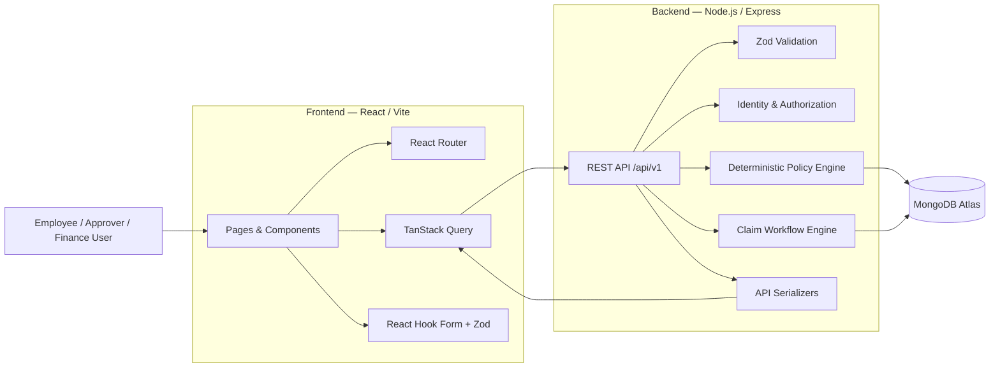
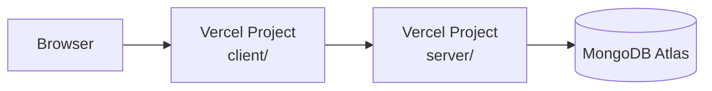
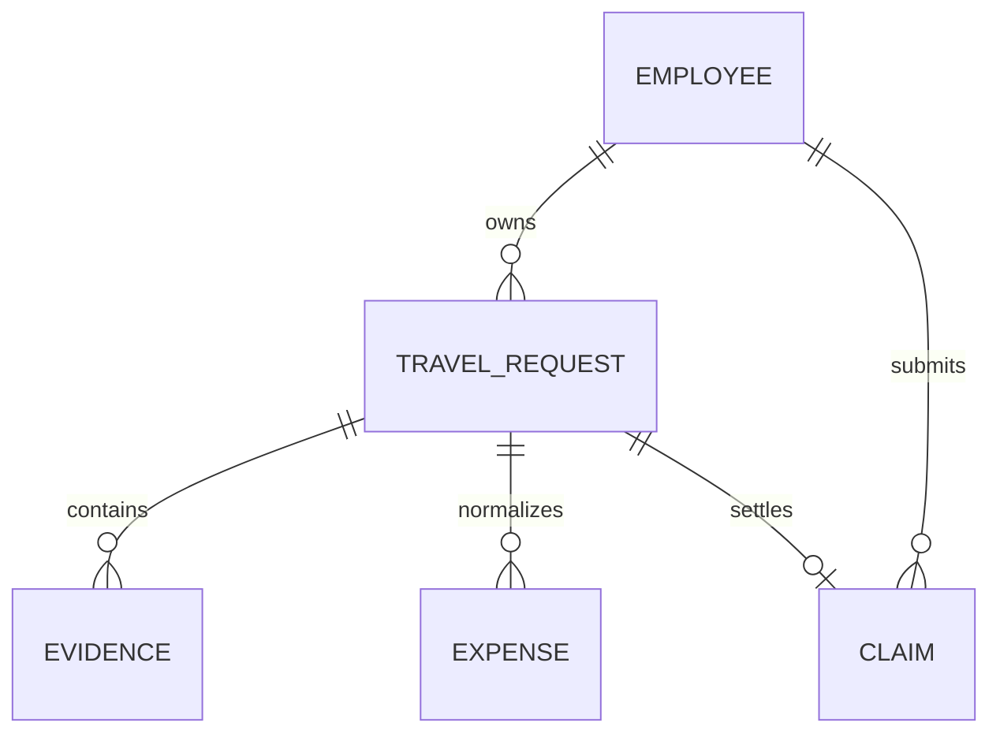
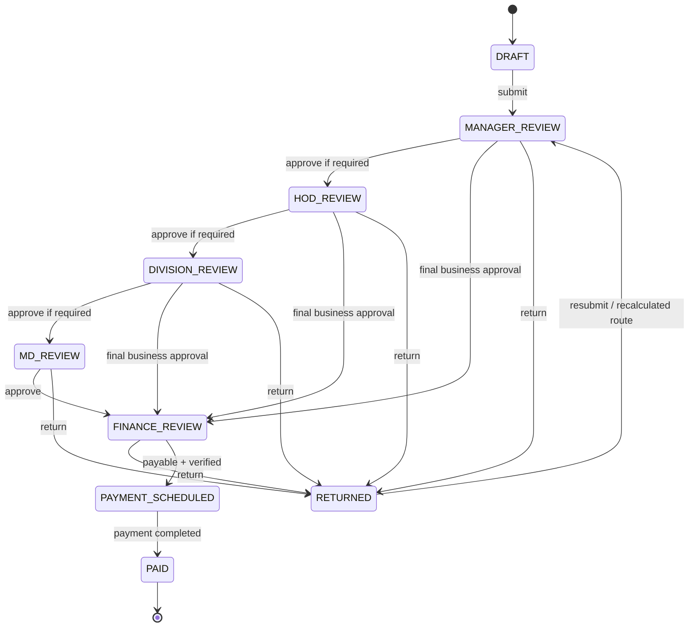
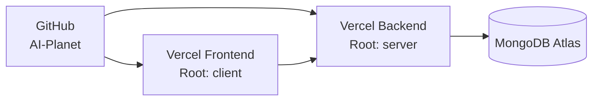

# AI Planet — Expense Reimbursement & Travel Settlement

A full-stack, policy-aware travel expense reimbursement system that converts fragmented travel evidence into a traceable employee claim, validates expenses against company policy, routes the claim through business approvals, and tracks Finance settlement through payment.

The application is built as a production-oriented MERN/TypeScript system with a strong emphasis on:

- evidence traceability
- deterministic financial rules
- human review of ambiguity
- server-authoritative workflow decisions
- auditability
- concurrency safety
- clean frontend/backend boundaries

> This repository is a take-home / engineering demonstration project based on a supplied travel-expense scenario.

---

## Project Links

| Resource           | Link                                                                       |
| ------------------ | -------------------------------------------------------------------------- |
| Live Application   | _Will be added after production deployment_                                |
| Swagger / API Docs | _Will be added after backend deployment_                                   |
| Repository         | [AI Planet on GitHub](https://github.com/akshaychavan23031998/AI-Planet)   |
| Portfolio          | [Akshay Chavan — Portfolio](https://akshay-chavan-portfolio.vercel.app/)   |
| GitHub Profile     | [github.com/akshaychavan23031998](https://github.com/akshaychavan23031998) |

---

## Table of Contents

- [Overview](#overview)
- [Business Problem](#business-problem)
- [What the Application Does](#what-the-application-does)
- [Demo Scenario](#demo-scenario)
- [Key Features](#key-features)
- [Architecture](#architecture)
- [Request Flow](#request-flow)
- [Technology Stack](#technology-stack)
- [Repository Structure](#repository-structure)
- [Domain & Database Design](#domain--database-design)
- [Evidence and Data Integrity](#evidence-and-data-integrity)
- [Policy Engine](#policy-engine)
- [Claim Workflow](#claim-workflow)
- [Approval Design](#approval-design)
- [Finance & Settlement](#finance--settlement)
- [Concurrency & Race Condition Protection](#concurrency--race-condition-protection)
- [Authorization & Trust Model](#authorization--trust-model)
- [Frontend Architecture](#frontend-architecture)
- [API Design](#api-design)
- [Error Handling](#error-handling)
- [Engineering Conventions](#engineering-conventions)
- [Local Development Setup](#local-development-setup)
- [Environment Variables](#environment-variables)
- [Database Seeding](#database-seeding)
- [Running the Application](#running-the-application)
- [Swagger / OpenAPI](#swagger--openapi)
- [Demo Personas](#demo-personas)
- [Recommended Demo Walkthrough](#recommended-demo-walkthrough)
- [Testing Strategy](#testing-strategy)
- [Test Commands](#test-commands)
- [Deployment Architecture](#deployment-architecture)
- [Deploying to Vercel](#deploying-to-vercel)
- [MongoDB Atlas Deployment Notes](#mongodb-atlas-deployment-notes)
- [Security Considerations](#security-considerations)
- [Assumptions & Limitations](#assumptions--limitations)
- [AI / LLM Decision](#ai--llm-decision)
- [Troubleshooting](#troubleshooting)
- [How to Extend the Project](#how-to-extend-the-project)
- [Author](#author)

---

# Overview

AI Planet is an internal-style employee travel expense settlement application.

It takes a real-world reimbursement problem where information is scattered across:

- travel-request emails
- approval emails
- flight tickets
- hotel booking vouchers
- hotel invoices
- cab receipts
- failed payment messages
- duplicate receipts
- colleague-forwarded receipts
- meal / entertainment bills
- employee hierarchy data
- company expense policy

and turns that information into a structured, reviewable claim.

The core design principle is:

> **Never fabricate certainty where the source evidence is incomplete.**

The system distinguishes between:

1. what the source evidence proves,
2. what deterministic policy rules can conclude,
3. what still requires human resolution,
4. and what should never be reimbursed.

---

# Business Problem

Traditional expense reimbursement often requires employees and Finance teams to manually reconcile multiple receipts, emails, policies, approvals and payment methods.

This creates several problems:

- duplicate claims
- company-paid expenses accidentally reimbursed again
- missing receipts
- unclear ownership
- policy violations
- wrong approval routing
- calculation mistakes
- stale approval decisions
- weak audit trails
- race conditions when multiple reviewers act at the same time

AI Planet models the full flow as:

```text
Evidence
   ↓
Normalized Expenses
   ↓
Employee Claim Decisions
   ↓
Policy Evaluation
   ↓
Submission Readiness
   ↓
Business Approvals
   ↓
Finance Verification
   ↓
Settlement
   ↓
Payment Tracking
```

---

# What the Application Does

The system allows a reviewer to move from raw travel evidence to a final financial settlement while preserving auditability.

### Employee experience

The employee can:

- view their trip
- inspect source evidence
- inspect normalized expenses
- see policy findings
- see eligible, disallowed and unresolved amounts
- exclude items intentionally
- restore excluded items
- explicitly resolve supported ambiguity
- view the settlement
- check submission readiness
- submit the claim
- review returned claims
- correct and resubmit

### Approver experience

Assigned business approvers can:

- view only claims currently assigned to them
- inspect claim context
- inspect evidence
- inspect policy findings
- inspect settlement
- inspect prior workflow history
- approve
- return a claim with remarks

### Finance experience

Authorized Finance users can:

- view the Finance queue
- inspect approved claims
- verify Finance review
- return a claim
- schedule an employee reimbursement
- record completed payment
- preserve payment metadata and audit history

---

# Demo Scenario

The canonical scenario follows **Chaitanya Reddy (`NX-4471`)** on a Pune → Bengaluru → Pune business trip during June 2026.

Important source facts include:

| Item                     | Source-backed fact                                    |
| ------------------------ | ----------------------------------------------------- |
| Employee                 | Chaitanya Reddy                                       |
| Employee code            | `NX-4471`                                             |
| Route                    | Pune → Bengaluru → Pune                               |
| Travel dates             | 16–20 June 2026                                       |
| Estimated spend          | ₹48,000                                               |
| Travel advance           | ₹20,000                                               |
| Flights                  | Company-paid                                          |
| Hotel                    | Employee-paid final invoice                           |
| Business dinner          | Requires additional review                            |
| Hotel tax                | Mixed final-invoice tax requiring explicit resolution |
| Historical RM approval   | Present                                               |
| Historical HOD approval  | Not proven                                            |
| Actual Travel Request ID | Unknown                                               |

The scenario deliberately includes messy evidence:

- a failed Uber payment followed by a successful payment
- a duplicate Uber receipt
- a receipt belonging to another employee
- marketing/promo content
- company-paid flights
- a hotel invoice containing both allowed and disallowed components
- unresolved tax allocation
- a dinner lacking sufficient approval / attendee information

These are **not silently cleaned up or discarded**.

They remain visible because traceability is more important than making the claim appear simpler.

---

# Key Features

### Evidence ingestion and traceability

- deterministic import from the supplied assignment pack
- email parsing
- receipt metadata preservation
- duplicate relationships
- source-to-expense links
- evidence detail drawer
- searchable/filterable evidence

### Expense normalization

- company-paid vs employee-paid separation
- source amount preservation
- duplicate handling
- failed-payment handling
- claimant mismatch detection
- mixed invoice componentization

### Deterministic policy engine

- proof requirements
- lodging limits
- meal limits
- entertainment rules
- company-paid handling
- known disallowances
- duplicate detection
- travel approval requirements
- claim approval routing
- advance assessment
- settlement calculation
- readiness evaluation

### Human-in-the-loop ambiguity resolution

The system never invents:

- missing approval
- missing attendee identities
- missing Travel Request ID
- final mixed-tax allocation

Human decisions are recorded explicitly against the Claim.

### Workflow and approvals

- manager review
- HOD review
- division review
- MD review
- Finance review
- return / correction / resubmission
- multi-cycle workflow history

### Finance workflow

- Finance verification
- payable / recoverable / zero settlement distinction
- payment-run scheduling
- payment completion reference
- audit history

### Reliability

- safe integer money representation
- actor-scoped frontend cache
- centralized API errors
- conditional workflow writes
- race-condition detection
- deterministic seed
- automated tests
- OpenAPI contract

---

# Architecture

The project is intentionally implemented as a simple, maintainable full-stack architecture rather than premature microservices.



## Deployment topology



The same Git repository contains both deployable applications.

They are deployed independently:

```text
GitHub Repository
│
├── client/   → Vercel Frontend Project
│
└── server/   → Vercel Backend Project
```

This keeps:

- one source repository
- independent deployment lifecycles
- independent environment variables
- clear frontend/backend boundaries

without introducing unnecessary infrastructure.

---

# Request Flow

A typical read request follows:

```text
React Component
    ↓
TanStack Query Hook
    ↓
Typed Native-Fetch API Client
    ↓
X-Demo-Employee-Code
    ↓
Express Route
    ↓
Identity Middleware
    ↓
Query / Domain Service
    ↓
Mongoose
    ↓
MongoDB Atlas
    ↓
Serializer
    ↓
JSON Response
    ↓
TanStack Query Cache
    ↓
React UI
```

A financial mutation follows a stricter path:

```text
Form
 ↓
React Hook Form + Zod
 ↓
API Request
 ↓
Backend Zod Validation
 ↓
Backend Authorization
 ↓
Policy / Workflow Validation
 ↓
Conditional MongoDB Update
 ↓
Refetch Authoritative State
 ↓
UI
```

The frontend never decides that a financial mutation succeeded based only on local state.

---

# Technology Stack

## Frontend

| Technology        | Responsibility                |
| ----------------- | ----------------------------- |
| React             | UI                            |
| TypeScript        | Static typing                 |
| Vite              | Development/build tooling     |
| React Router      | Client-side routing           |
| TanStack Query    | Server-state fetching/caching |
| React Hook Form   | Form state                    |
| Zod               | Client validation             |
| Native `fetch`    | HTTP client                   |
| CSS Modules       | Component styling             |
| Shared CSS tokens | Design consistency            |
| Lucide React      | Icons                         |
| Sonner            | Mutation notifications        |
| Vitest            | Frontend tests                |
| Testing Library   | UI behavior tests             |
| jsdom             | Browser-like test environment |

## Backend

| Technology             | Responsibility                 |
| ---------------------- | ------------------------------ |
| Node.js                | Runtime                        |
| Express                | HTTP API                       |
| TypeScript             | Static typing                  |
| MongoDB Atlas          | Persistent database            |
| Mongoose               | ODM                            |
| Zod                    | Environment/request validation |
| Pino / pino-http       | Structured logging             |
| Mailparser             | Email source parsing           |
| csv-parse              | Employee master parsing        |
| OpenAPI 3.0.3          | API contract                   |
| Swagger UI             | Interactive API documentation  |
| Supertest              | API integration tests          |
| Node test runner + tsx | Backend domain tests           |

---

# Repository Structure

```text
AI-Planet/
│
├── client/
│   ├── src/
│   │   ├── api/
│   │   │   ├── client.ts
│   │   │   ├── claims.ts
│   │   │   ├── claimTypes.ts
│   │   │   ├── evidence.ts
│   │   │   ├── expenses.ts
│   │   │   ├── travelRequests.ts
│   │   │   └── workflow.ts
│   │   │
│   │   ├── app/
│   │   │   ├── queryClient.ts
│   │   │   ├── queries.ts
│   │   │   ├── claimQueries.ts
│   │   │   ├── workflowQueries.ts
│   │   │   └── router.tsx
│   │   │
│   │   ├── components/
│   │   │   ├── claims/
│   │   │   ├── AppShell.tsx
│   │   │   ├── Sidebar.tsx
│   │   │   ├── Header.tsx
│   │   │   ├── EvidenceDrawer.tsx
│   │   │   └── ...
│   │   │
│   │   ├── context/
│   │   │   └── DemoIdentityProvider.tsx
│   │   │
│   │   ├── pages/
│   │   │   ├── DashboardPage.tsx
│   │   │   ├── TripPage.tsx
│   │   │   ├── EvidencePage.tsx
│   │   │   ├── ClaimPage.tsx
│   │   │   └── ReviewWorkspace.tsx
│   │   │
│   │   ├── styles/
│   │   ├── test/
│   │   └── utils/
│   │
│   ├── .env.example
│   ├── package.json
│   ├── vite.config.ts
│   └── vercel.json
│
├── server/
│   ├── src/
│   │   ├── api/
│   │   │   └── v1/
│   │   │
│   │   ├── domain/
│   │   │   ├── policy/
│   │   │   └── claims/
│   │   │
│   │   ├── modules/
│   │   ├── openapi/
│   │   ├── seed/
│   │   ├── app.ts
│   │   ├── database.ts
│   │   ├── env.ts
│   │   ├── errorHandler.ts
│   │   └── server.ts
│   │
│   ├── .env.example
│   ├── package.json
│   └── tsconfig.json
│
├── docs/
│   └── canonical-assignment-data.md
│
├── package.json
├── package-lock.json
└── README.md
```

## Directory responsibilities

### `client/src/api`

Typed browser API calls.

No UI logic belongs here.

### `client/src/app`

Application-level query hooks, router configuration and TanStack Query behavior.

### `client/src/components`

Reusable presentation and interaction components.

### `client/src/context`

Small cross-application state.

Currently used only for demo identity selection.

### `client/src/pages`

Route-level compositions.

Pages orchestrate reusable components and queries rather than implementing backend policy.

### `server/src/api/v1`

HTTP boundary:

- routes
- identity middleware
- validation
- query orchestration
- serializers
- API error mapping

### `server/src/domain/policy`

Pure financial and policy evaluation.

This layer should not depend on Express or React.

### `server/src/domain/claims`

Claim workflow, authorization, approval routing, Finance actions and concurrency rules.

### `server/src/modules`

Mongoose persistence models.

### `server/src/openapi`

OpenAPI specification and contract tests.

### `server/src/seed`

Deterministic assignment-pack import.

### `docs/canonical-assignment-data.md`

Frozen interpretation of the provided source pack.

This document separates:

- source facts
- deterministic conclusions
- product decisions
- unresolved facts

---

# Domain & Database Design

The application persists five major domain areas.



## Employee

Represents:

- employee code
- organizational role
- department
- cost centre
- city
- reporting manager

Employee data is also the authority for demo-role resolution.

## TravelRequest

Represents pre-travel context such as:

- claimant
- route
- dates
- purpose
- estimate
- advance
- historical approval evidence

Travel Request approval and final Claim approval are intentionally separate concepts.

## Evidence

Evidence is the preserved source layer.

Examples:

- emails
- tickets
- booking vouchers
- cab receipts
- failed payments
- duplicate receipts
- hotel invoice
- dinner receipt

Evidence answers:

> **What did the source material actually say?**

## Expense

Expense is the normalized financial-event layer.

Examples:

- outbound flight
- return flight
- Uber ride
- hotel room
- laundry
- minibar
- hotel dining
- hotel tax
- business dinner

Expense answers:

> **What cost event can be derived from the evidence?**

## Claim

Claim represents employee reimbursement decisions and workflow state.

It contains concepts such as:

- expense reviews
- exclusion decisions
- manual resolutions
- review history
- approval route
- approval decisions
- workflow history
- review cycle
- workflow version
- Finance metadata

Claim answers:

> **What is being requested for reimbursement, how was it reviewed, and where is it in the workflow?**

---

# Database Design Principles

### MongoDB ObjectIds

MongoDB ObjectIds are used for internal document identity.

The application's route IDs are database document IDs.

They are **not** the business Travel Request ID.

The actual business Travel Request ID in the source scenario is unknown and is intentionally not invented.

### Money

All backend money is represented as integer **paise**.

Example:

```text
₹1,415.02
→ 141502 paise
```

This prevents financial logic from depending on binary floating-point arithmetic.

### Business dates

Business dates such as:

```text
2026-06-18
```

remain `YYYY-MM-DD` strings where the time of day is not meaningful.

Timestamps are stored as actual date-time values.

### Immutable source truth

Employee Claim decisions never modify original Evidence or Expense records.

An employee excluding an expense means:

```text
Source Expense remains unchanged
+
Claim stores an exclusion decision
```

This keeps auditability intact.

---

# Evidence and Data Integrity

The application intentionally preserves inconvenient evidence.

Examples:

### Duplicate receipt

Both the canonical receipt and the duplicate evidence remain visible.

The duplicate must not create a second reimbursement.

### Failed payment

A failed payment remains in Evidence because it explains the subsequent successful payment.

It is not reimbursable itself.

### Claimant mismatch

A receipt belonging to another employee remains visible but cannot silently become the claimant's expense.

### Company-paid flight

The flight remains visible as travel cost, but its employee reimbursement amount is zero.

### Missing information

The system does not invent:

- HOD approval
- dinner attendee names
- Travel Request ID
- final tax allocation

---

# Policy Engine

Financial policy evaluation is deterministic and backend-authoritative.

The main policy layer lives under:

```text
server/src/domain/policy/
```

It evaluates plain domain data rather than UI state.

## Policy categories

The evaluator covers rules such as:

- expense proof
- employee-paid vs company-paid
- duplicate recognition
- failed payments
- lodging allowance
- disallowed hotel components
- hotel dining
- mixed hotel tax
- meal limits
- business entertainment
- historical travel approvals
- Claim approval thresholds
- advance assessment
- settlement
- submission readiness

## Final vs provisional settlement

The system distinguishes:

```text
Known eligible
Known disallowed
Unresolved
Excluded
```

If unresolved included amounts remain, the settlement is provisional.

In that situation:

```text
payableMinor = null
recoverableMinor = null
```

The UI displays this as pending resolution rather than pretending the result is ₹0.

---

# Human-in-the-Loop Resolution

The project intentionally does not use automation to manufacture missing facts.

A good example is final hotel tax.

The hotel invoice provides combined tax across multiple folio components.

The source material does not prove a unique final allocation.

Therefore the application:

1. preserves the original tax evidence,
2. reports the ambiguity,
3. blocks final settlement,
4. allows an explicit reviewed allocation,
5. records who resolved it,
6. records the reason.

This is different from silently changing the source invoice.

---

# Claim Workflow

Persistent Claim states are exactly:

```text
DRAFT
MANAGER_REVIEW
HOD_REVIEW
DIVISION_REVIEW
MD_REVIEW
FINANCE_REVIEW
RETURNED
PAYMENT_SCHEDULED
PAID
```

`SUBMITTED` and `RESUBMITTED` are **workflow history events**, not stored Claim statuses.



Not every claim passes through every business-review state.

The backend calculates the required route.

---

# Approval Design

Two approval concepts exist.

## Travel Request approval

Based on the **estimated pre-travel spend**.

For the canonical scenario:

```text
Estimated spend = ₹48,000
```

The current policy requires:

```text
Reporting Manager
+
Head of Department
```

The supplied evidence proves only the Reporting Manager approval.

The missing HOD approval remains a historical warning.

## Expense Claim approval

Final Claim routing uses the actual Claim amount being requested under policy.

This is different from pre-travel routing.

The frontend never implements threshold logic independently.

The backend determines:

- required approval levels
- exact assigned approver
- next workflow state

---

# Finance & Settlement

Finance is a mandatory review stage.

## Finance verification

Finance verification records the current-cycle Finance decision.

It may leave the Claim status as:

```text
FINANCE_REVIEW
```

Verification does not automatically mean payment.

## Settlement directions

A final settlement can be:

```text
PAYABLE
RECOVERABLE
ZERO
```

### PAYABLE

Company owes money to the employee.

Eligible for reimbursement scheduling.

### RECOVERABLE

Employee owes money back to the company.

No fake reimbursement payment is created.

### ZERO

No amount is payable or recoverable.

No unnecessary payment state is fabricated.

## Payment scheduling

For payable settlements, the backend enforces payment-run dates.

Supported payment runs occur on:

```text
10th
or
25th
```

and must not be in the past.

## Mark paid

Marking payment complete requires:

- an eligible scheduled payment
- the scheduled date to have arrived
- a non-empty payment reference

The project records payment metadata only.

It does not connect to a real bank or payroll provider.

---

# Concurrency & Race Condition Protection

Claim workflow updates use conditional MongoDB writes.

A mutation validates multiple pieces of expected state, including:

```text
Claim ID
claimant
expected status
review cycle
workflow version
```

The Claim maintains a monotonically increasing:

```text
workflowVersion
```

If two reviewers attempt incompatible updates concurrently:

```text
Request A reads version 4
Request B reads version 4

Request A updates version 4 → 5
Request B attempts update using version 4
↓
conditional update no longer matches
↓
CLAIM_STATE_CONFLICT
```

The second request must refetch the latest Claim state.

This prevents silent lost updates.

It is optimistic concurrency control, not a distributed lock.

## Review input fingerprint

Submission stores a fingerprint of the policy-relevant input.

Later business/Finance approval verifies that the reviewed input has not silently changed.

If financial/evidence context changes:

```text
CLAIM_STATE_CONFLICT
```

The previous approvals are not reused against materially changed input.

---

# Authorization & Trust Model

This project uses deliberate **demo impersonation**, not production authentication.

The selected persona is sent as:

```http
X-Demo-Employee-Code: NX-4471
```

The browser does **not** send an authoritative role.

The backend loads Employee data and determines:

- organizational role
- manager hierarchy
- exact approver
- Finance permissions
- claimant ownership

This means changing a frontend label from:

```text
Employee
```

to:

```text
Finance
```

would not grant Finance permissions.

## Production replacement

A production system would replace demo identity with an authentication solution such as:

- enterprise SSO
- OIDC
- authenticated session
- JWT-backed identity gateway

The downstream authorization architecture could remain similar.

---

# Frontend Architecture

The frontend intentionally avoids unnecessary global-state complexity.

## React Router

Owns application routes:

```text
/
/trips/:travelRequestId
/trips/:travelRequestId/evidence
/claims/:claimId
/approvals
/finance
```

## TanStack Query

Owns server state:

- trips
- evidence
- expenses
- Claims
- policy evaluation
- settlement
- readiness
- approval queues
- Finance queues

## Demo Identity Context

Context stores only the selected demo employee identity.

This is small application-wide state.

Redux is intentionally not used because the application does not have a large client-owned state graph.

## Local component state

UI-only state remains local.

Examples:

- selected row
- open drawer
- current modal
- search text
- filters

## Forms

Substantive forms use:

```text
React Hook Form
+
Zod
```

Examples:

- expense exclusion
- mixed tax resolution
- return remarks
- payment scheduling
- payment reference

---

# Actor-Scoped Query Cache

Protected frontend query keys include the selected employee code.

Conceptually:

```text
actor
  / NX-4471
  / claim
  / <claimId>
```

This prevents data cached for Chaitanya from being incorrectly reused when another persona is selected.

After mutations, affected actor-scoped queries are invalidated/refetched.

Financial state is not optimistically invented on the client.

---

# API Design

The backend exposes a versioned REST API under:

```text
/api/v1
```

## Operational endpoints

```http
GET /health
GET /ready
```

## Documentation

```http
GET /openapi.json
GET /docs
```

## Public demo endpoint

```http
GET /api/v1/demo/users
```

## Protected API groups

Protected routes require:

```http
X-Demo-Employee-Code
```

Major API groups:

### Travel Requests

```text
/api/v1/travel-requests
```

### Evidence

```text
/api/v1/travel-requests/:id/evidence
/api/v1/evidence/:id
```

### Expenses

```text
/api/v1/travel-requests/:id/expenses
```

### Claims

```text
/api/v1/claims
/api/v1/claims/:id
/api/v1/claims/:id/validation
/api/v1/claims/:id/readiness
/api/v1/claims/:id/settlement
```

### Claim review actions

```text
exclude
restore
resolve
submit
resubmit
```

### Approvals

```text
/api/v1/approvals
approve
return
```

### Finance

```text
/api/v1/finance/claims
verify
schedule-payment
mark-paid
```

See Swagger for the authoritative operation schemas.

---

# API Response Convention

Successful single-resource responses generally use:

```json
{
  "data": {}
}
```

Collections use:

```json
{
  "data": [],
  "meta": {
    "count": 0
  }
}
```

Errors use:

```json
{
  "error": {
    "code": "ERROR_CODE",
    "message": "Human readable message",
    "details": {}
  }
}
```

---

# Error Handling

The API centralizes error mapping.

Broad HTTP semantics:

|  HTTP | Meaning                                     |
| ----: | ------------------------------------------- |
| `400` | Invalid request / validation                |
| `401` | Missing or invalid demo identity            |
| `403` | Authorization denied                        |
| `404` | Resource not found                          |
| `409` | Workflow / concurrent-state conflict        |
| `422` | Valid request blocked by domain/policy rule |
| `500` | Unexpected server error                     |

Important domain errors include:

```text
POLICY_NOT_READY
CLAIM_STATE_CONFLICT
INVALID_MANUAL_RESOLUTION
RETURN_REMARKS_REQUIRED
INVALID_PAYMENT_DATE
PAYMENT_REFERENCE_REQUIRED
ACTION_NOT_ALLOWED
```

The frontend presents controlled messages rather than raw stack traces.

---

# Engineering Conventions

This section defines where new code should live and the standards used throughout the project.

## TypeScript

- prefer explicit domain types
- avoid `any`
- keep HTTP shapes separate from persistence concepts
- use discriminated unions for stateful commands where appropriate
- let TypeScript catch invalid state assumptions early

## Backend layering

### Routes should remain thin

Express handlers should primarily:

1. parse request input,
2. resolve identity,
3. call query/domain services,
4. serialize output.

Policy logic does not belong in route handlers.

### Validation

HTTP input is validated using Zod.

### Domain logic

Business rules belong under:

```text
server/src/domain/
```

Pure calculation should remain independent of Express and React where practical.

### Serialization

HTTP response shapes are explicitly serialized rather than leaking Mongoose documents directly.

### Errors

Public error mapping is centralized.

Internal exceptions should not expose credentials or database connection information.

---

# Frontend Conventions

### Server state

Use TanStack Query.

Do not manually maintain copies of backend state in Context.

### Identity

Only demo employee identity belongs in the tiny Context.

### Forms

Use React Hook Form + Zod for substantive forms.

### Financial rules

Never reproduce backend policy calculations inside components.

Frontend code may format backend values but must not become a second policy engine.

### Mutations

Do not automatically retry financial/workflow mutations.

Do not optimistically invent:

- statuses
- settlements
- approvals
- Finance state

Refetch the authoritative result.

---

# Money Convention

Backend:

```text
integer paise
```

UI:

```text
formatted INR
```

Do not use naïve:

```ts
Number(value) * 100;
```

for authoritative financial input conversion.

---

# Date Convention

Distinguish:

### Business date

```text
YYYY-MM-DD
```

### Timestamp

Date/time with actual time semantics.

Do not timezone-shift date-only business facts unnecessarily.

---

# Styling Convention

The frontend uses:

```text
CSS Modules
+
shared design tokens
```

New pages should reuse existing:

- spacing
- typography
- cards
- status badges
- button hierarchy
- responsive breakpoints

rather than introducing a second design system.

---

# Accessibility Convention

Prefer semantic HTML before ARIA.

Important interaction requirements include:

- keyboard access
- labelled controls
- focus visibility
- focus restoration
- native dialog semantics where practical
- Escape handling
- status text beyond color alone
- useful empty/error states

---

# Logging

The backend uses Pino / pino-http.

Routine request logging intentionally avoids logging sensitive request:

- headers
- query values
- bodies

Logs capture operational request metadata without unnecessarily exposing private content.

---

# Local Development Setup

## Prerequisites

Install:

- Node.js **22.20+**
- npm
- Git
- MongoDB Atlas account / cluster

For a fresh database seed, you also need the original supplied assignment pack.

Check versions:

```bash
node --version
npm --version
git --version
```

---

## 1. Clone the repository

```bash
git clone https://github.com/akshaychavan23031998/AI-Planet.git
cd AI-Planet
```

---

## 2. Install dependencies

From the repository root:

```bash
npm install
```

The project uses npm workspaces:

```text
client
server
```

---

## 3. Configure the server

Create:

```text
server/.env
```

using:

```text
server/.env.example
```

Example:

```env
NODE_ENV=development
PORT=3000
CLIENT_ORIGIN=http://localhost:5173

MONGODB_URI=mongodb+srv://<username>:<password>@<cluster-host>/
MONGODB_DB_NAME=ai_planet_expense
```

Never commit `server/.env`.

---

## 4. Configure the client

Local development defaults to:

```text
http://localhost:3000
```

for the API.

If you want an explicit client config, create:

```text
client/.env
```

from:

```text
client/.env.example
```

Example:

```env
VITE_API_BASE_URL=http://localhost:3000
```

`VITE_*` variables are public browser configuration.

Never put secrets in them.

---

# Environment Variables

## Server

| Variable          | Required     | Secret  | Purpose                             |
| ----------------- | ------------ | ------- | ----------------------------------- |
| `MONGODB_URI`     | Yes          | **Yes** | MongoDB Atlas connection            |
| `MONGODB_DB_NAME` | Yes          | No      | Logical DB name                     |
| `NODE_ENV`        | No           | No      | `development`, `test`, `production` |
| `PORT`            | Local server | No      | Express local port                  |
| `CLIENT_ORIGIN`   | Yes          | No      | Exact allowed frontend origin       |

Recommended database name:

```text
ai_planet_expense
```

## Client

| Variable            | Required        | Secret | Purpose               |
| ------------------- | --------------- | ------ | --------------------- |
| `VITE_API_BASE_URL` | Production: Yes | **No** | Backend public origin |

---

# Database Seeding

The seed converts the supplied assignment pack into deterministic MongoDB records.

The pack is **not required during normal application startup after the database has been seeded**.

## PowerShell

```powershell
$env:ASSIGNMENT_PACK_PATH="<path-to-assignment-pack>"
npm run seed
Remove-Item Env:ASSIGNMENT_PACK_PATH
```

## Expected canonical dataset

```text
9 Employees
1 TravelRequest
17 Evidence
14 Expenses
1 Claim
```

## Seed guarantees

The importer:

- validates the expected source inventory
- validates pinned source hashes
- parses employee CSV data
- parses email metadata/content
- uses canonical receipt metadata
- creates deterministic records
- reuses seeded identities
- restores canonical seeded source state when rerun

The source hashes prevent accidental modification of assignment truth from silently changing the demo dataset.

---

# Canonical Reset

Workflow actions intentionally mutate the seeded Claim.

To restore the deterministic demo scenario, rerun the assignment seed using the original validated source pack.

The canonical Claim begins as:

```text
DRAFT
reviewCycle = 0
no business approvals
no workflow events
no Finance state
no employee review decisions
```

This is useful before recording a fresh demonstration.

---

# Running the Application

## Start frontend and backend together

From the repository root:

```bash
npm run dev
```

Default URLs:

| Service   | URL                                  |
| --------- | ------------------------------------ |
| Frontend  | `http://localhost:5173`              |
| Backend   | `http://localhost:3000`              |
| Swagger   | `http://localhost:3000/docs`         |
| OpenAPI   | `http://localhost:3000/openapi.json` |
| Health    | `http://localhost:3000/health`       |
| Readiness | `http://localhost:3000/ready`        |

---

## Start separately

Backend:

```bash
npm run dev:server
```

Frontend:

```bash
npm run dev:client
```

---

## Production-style local build

```bash
npm run build
```

Run compiled backend:

```bash
npm run start --workspace server
```

Preview frontend build:

```bash
npm run preview --workspace client
```

---

# Swagger / OpenAPI

Local Swagger UI:

```text
http://localhost:3000/docs
```

OpenAPI JSON:

```text
http://localhost:3000/openapi.json
```

Swagger documents:

- health
- readiness
- demo identities
- trips
- evidence
- expenses
- Claims
- policy validation
- settlement
- readiness
- approvals
- Finance

## Swagger authorization

Click:

```text
Authorize
```

and enter:

```text
NX-4471
```

Swagger then sends:

```http
X-Demo-Employee-Code: NX-4471
```

Changing the employee code simulates another demo actor.

---

# Example API Request

```http
GET /api/v1/claims
X-Demo-Employee-Code: NX-4471
```

For the full contract, use Swagger rather than duplicating schemas in this README.

---

# Demo Personas

The seeded employee hierarchy includes:

| Employee Code | Person          | Demo role                          |
| ------------- | --------------- | ---------------------------------- |
| `NX-4471`     | Chaitanya Reddy | Claimant                           |
| `NX-2210`     | Suresh Iyer     | Reporting Manager                  |
| `NX-1108`     | Meera Krishnan  | Head of Department                 |
| `NX-1002`     | Arvind Rao      | Head of Division                   |
| `NX-1000`     | Nandita Shah    | Managing Director                  |
| `NX-3305`     | Ravi Menon      | Finance                            |
| `NX-3300`     | Kavitha Balan   | Finance Controller                 |
| `NX-5182`     | Deepa Nair      | Unrelated employee / receipt owner |
| `NX-4490`     | Imran Qureshi   | Employee with no supplied trip     |

Important:

A persona without a TravelRequest should not receive fake Trip / Evidence / Claim IDs.

For example, Imran can use global workspace routes but has no seeded trip to open.

---

# Recommended Demo Walkthrough

Start with a fresh seeded Claim.

## 1. Employee

Select:

```text
Chaitanya Reddy — NX-4471
```

Explore:

```text
Overview
Trip request
Evidence inbox
Claim review
```

Inspect:

- trip facts
- historical RM approval
- missing HOD evidence
- flights
- hotel
- Uber receipts
- failed payment
- duplicate receipt
- colleague receipt
- dinner
- settlement
- readiness

## 2. Resolve the employee Claim

The initial Claim is intentionally not ready.

Demonstrate controlled decisions such as:

- excluding the unsupported business dinner if desired
- explicitly resolving mixed hotel tax with a defensible manual allocation

Do not fabricate missing evidence.

## 3. Submit

Once backend readiness becomes true:

```text
Submit claim
```

The backend selects the required review route.

## 4. Approvals

Switch to the exact assigned approver.

For example:

```text
Suresh Iyer
```

Open:

```text
Approvals
```

Approve or return based on the demonstration.

Continue through any additional required business-review stages.

## 5. Finance

Switch to an authorized Finance persona.

Open:

```text
Finance
```

Demonstrate:

- verification
- settlement
- payment scheduling if payable
- payment completion when allowed

## 6. Reset

After a destructive workflow demonstration, rerun the deterministic seed to return the scenario to its canonical initial state.

---

# Testing Strategy

Testing is layered by responsibility.

## Policy unit tests

Validate:

- financial arithmetic
- eligibility
- disallowances
- duplicates
- approval requirements
- settlement
- readiness

These tests do not need MongoDB.

## Workflow tests

Validate:

- submission
- approval stages
- returns
- resubmission
- Finance verification
- payment scheduling
- authorization
- race protection

## API integration tests

Supertest validates:

- middleware
- routes
- status codes
- request validation
- authorization
- response contracts
- errors

Mongo query boundaries are isolated for testability.

## OpenAPI contract tests

Validate:

- OpenAPI structure
- documented operations
- schema/reference integrity
- Swagger endpoints

## Frontend tests

Vitest + Testing Library validate:

- typed API calls
- identity behavior
- actor cache isolation
- Dashboard
- Trip
- Evidence
- Claim
- policy findings
- settlement
- manual resolution
- submit/resubmit
- Approvals
- Finance
- dialogs
- error behavior
- keyboard interaction

## Seed tests

Source-backed tests validate the supplied assignment pack without writing to MongoDB.

---

# Test Commands

Run all regular tests:

```bash
npm test
```

Current regular baseline:

```text
329 passing tests
```

Current suite distribution:

```text
57  policy
55  workflow
42  API
11  OpenAPI
164 client
```

Run individual suites:

```bash
npm run test:policy
npm run test:workflow
npm run test:api
npm run test:openapi
npm run test:client
```

Run source-pack seed validation:

```powershell
$env:ASSIGNMENT_PACK_PATH="<path-to-assignment-pack>"
npm run test:seed
Remove-Item Env:ASSIGNMENT_PACK_PATH
```

Current seed suite:

```text
3 passing tests
```

---

# Code Quality Commands

Before committing:

```bash
npm run lint
npm run typecheck
npm run build
npm run format:check
npm test
```

Then run:

```bash
git diff --check
```

---

# Deployment Architecture

The repository is designed for:

```text
One GitHub repository
+
Two Vercel projects
+
MongoDB Atlas
```



---

# Deploying to Vercel

Production deployment uses the same repository twice.

## Project 1 — Frontend

Import:

```text
https://github.com/akshaychavan23031998/AI-Planet
```

Set:

```text
Root Directory: client
Framework: Vite
Build Command: npm run build
Output Directory: dist
```

Environment:

```env
VITE_API_BASE_URL=https://<backend-vercel-domain>
```

The frontend includes a Vercel SPA rewrite configuration so direct navigation to React Router routes resolves to `index.html`.

Examples:

```text
/claims/<id>
/approvals
/finance
```

must continue working after refresh.

---

# Project 2 — Backend

Import the **same GitHub repository** again.

Set:

```text
Root Directory: server
Framework: Express / Node.js
```

The backend is deployed as an Express application on Vercel.

Production environment variables:

```env
NODE_ENV=production
CLIENT_ORIGIN=https://<frontend-vercel-domain>

MONGODB_URI=<production-atlas-uri>
MONGODB_DB_NAME=ai_planet_expense
```

Do not expose `MONGODB_URI` to the frontend project.

The backend must continue to expose:

```text
/health
/ready
/docs
/openapi.json
/api/v1/*
```

---

# Deployment Environment Handshake

The frontend needs the backend URL:

```text
VITE_API_BASE_URL
```

The backend needs the frontend URL:

```text
CLIENT_ORIGIN
```

A practical deployment sequence is:

```text
1. Create frontend Vercel project.
2. Obtain frontend domain.

3. Create backend Vercel project.
4. Set CLIENT_ORIGIN to frontend domain.
5. Configure MongoDB Atlas environment variables.
6. Deploy backend.
7. Obtain backend domain.

8. Set frontend VITE_API_BASE_URL to backend domain.
9. Redeploy frontend.

10. Production smoke test.
```

The production URLs will be added to the Project Links section after successful deployment.

---

# MongoDB Atlas Deployment Notes

The backend is the only application that connects to MongoDB Atlas.

## Database user

Prefer a dedicated application user with only the permissions required by this application.

Recommended scope:

```text
readWrite
on
ai_planet_expense
```

Do not use an Atlas administrative account as the application runtime credential.

## Network access

Vercel serverless / Fluid Compute infrastructure may use dynamic outbound addresses depending on the selected networking plan.

For a take-home/demo environment, Atlas may need network access broad enough for the Vercel backend to connect.

If using:

```text
0.0.0.0/0
```

treat it as a demo-network tradeoff and compensate with:

- strong unique credentials
- least-privilege database user
- secret storage in Vercel only

A production enterprise environment should prefer stronger network controls such as:

- restricted egress
- static outbound IPs
- private connectivity
- network peering / private endpoint options where available

---

# Production Smoke Test

After deployment verify:

## Backend

```text
GET /health
GET /ready
GET /openapi.json
GET /docs
GET /api/v1/demo/users
```

Expected:

```text
/health → 200
/ready  → 200 with database connected
```

## Frontend

Verify direct navigation and refresh for:

```text
/
/trips/:travelRequestId
/trips/:travelRequestId/evidence
/claims/:claimId
/approvals
/finance
```

## Persona switching

Verify:

```text
Chaitanya
→ Suresh
→ Meera
→ Ravi/Kavitha
→ Imran
```

does not leak prior persona state.

## Workflow

Only perform production mutations when intentionally testing the demo database.

Reset the canonical Claim afterward if required.

---

# Security Considerations

## Server-side secrets

Secrets belong only in:

```text
server/.env
```

or backend deployment environment variables.

Never place secrets in:

```text
VITE_*
```

because Vite variables are visible to the browser.

## CORS

The backend uses the configured exact frontend origin.

Production should configure:

```text
CLIENT_ORIGIN=https://<frontend-domain>
```

Do not use wildcard CORS as a deployment shortcut.

## Authorization

Frontend controls are not security boundaries.

The backend independently checks:

- claimant
- exact approver
- hierarchy
- Finance role
- self-approval
- workflow state

## Source integrity

Claim actions do not modify original Evidence/Expense data.

## Financial integrity

Policy, settlement and workflow decisions are backend-authoritative.

## Concurrency

Claim state/version guards protect against stale simultaneous workflow writes.

---

# Assumptions & Limitations

This project intentionally focuses on the core reimbursement workflow.

Current limitations include:

### Demo identity instead of production authentication

There is no real SSO/login system.

`X-Demo-Employee-Code` exists only to demonstrate authorization and personas.

### Single canonical scenario

The assignment seed focuses on one complete travel-expense scenario.

The architecture supports multiple documents, but the supplied scenario is the primary demo dataset.

### No runtime OCR

Receipt facts are supplied/pre-extracted deterministically.

The application does not perform live OCR.

### Receipt binary serving

Receipt image evidence is represented through metadata/reference relationships.

The backend does not currently serve receipt binaries to the browser.

### No mailbox integration

There is no Gmail or Outlook connector.

The supplied `.eml` evidence is imported deterministically.

### No real payment execution

Finance payment actions record workflow metadata.

There is no payroll or bank integration.

### No notifications

Email/Slack notifications are outside the current scope.

### No multi-currency settlement

The canonical workflow uses INR.

### No production identity provider

A real deployment would integrate corporate identity infrastructure.

---

# AI / LLM Decision

The application deliberately does **not** use OpenAI, Gemini or another LLM to make authoritative financial decisions.

These areas remain deterministic:

```text
Policy
Eligibility
Disallowances
Settlement
Approval routing
Workflow transitions
Authorization
Payment eligibility
```

This prevents probabilistic output from deciding employee financial outcomes.

A future AI layer could be useful for advisory tasks such as:

- evidence summarization
- plain-English policy explanation
- category suggestions
- missing-information hints
- duplicate candidates

but such output should remain non-authoritative and subject to deterministic validation.

---

# Source of Truth

The project follows this precedence:

```text
Original assignment evidence / policy
        ↓
docs/canonical-assignment-data.md
        ↓
deterministic seed
        ↓
backend domain rules
        ↓
REST API
        ↓
frontend UI
```

The UI is never the authoritative source of financial truth.

---

# Troubleshooting

## `/ready` returns 503

Check:

```text
MONGODB_URI
MONGODB_DB_NAME
Atlas Network Access
Atlas database-user credentials
```

`/health` may still return 200 because HTTP liveness and database readiness are separate.

---

## Browser shows CORS error

Verify backend:

```env
CLIENT_ORIGIN=http://localhost:5173
```

for local development.

For production:

```env
CLIENT_ORIGIN=https://<frontend-domain>
```

The value should be an origin, not a URL path.

---

## Frontend cannot reach API

Check:

```env
VITE_API_BASE_URL=http://localhost:3000
```

locally.

Production must use the deployed backend origin.

---

## Trip / Evidence / Claim links are unavailable for a persona

That employee may not have a seeded TravelRequest.

This is expected for personas such as:

```text
Imran Qureshi
```

The application does not invent IDs or reuse another employee's trip.

---

## Claim cannot be submitted

Inspect:

```text
Policy Findings
Submission Readiness
Unresolved Amounts
```

The backend may intentionally return:

```text
POLICY_NOT_READY
```

until blocking ambiguity is resolved or excluded appropriately.

---

## Workflow action reports conflict

A:

```text
CLAIM_STATE_CONFLICT
```

means the Claim changed after the current screen's state was loaded.

Refetch and review the latest state before trying again.

---

# How to Extend the Project

A typical new backend feature should follow this sequence:

```text
1. Define/extend domain behavior.
2. Add domain tests.
3. Add persistence changes if required.
4. Add Zod API validation.
5. Add/extend API route.
6. Add serializer.
7. Update OpenAPI contract/tests.
8. Add typed frontend API function.
9. Add actor-scoped TanStack Query hook.
10. Add UI.
11. Add frontend tests.
12. Run full regression.
```

This keeps business rules out of controllers and UI components.

---

# Design Decisions Summary

| Decision                          | Reason                                          |
| --------------------------------- | ----------------------------------------------- |
| Monorepo with `client` + `server` | Simple development and independent deployments  |
| React SPA                         | Appropriate for internal workflow UI            |
| Express REST API                  | Clear HTTP/domain separation                    |
| MongoDB + Mongoose                | Flexible document-oriented workflow persistence |
| Integer paise                     | Financial precision                             |
| YYYY-MM-DD business dates         | Avoid date-only timezone bugs                   |
| Deterministic policy engine       | Financial predictability                        |
| Evidence/Expense immutability     | Auditability                                    |
| Claim-local decisions             | Preserve source truth                           |
| Demo identity header              | Demonstrate personas without fake auth          |
| Backend authorization             | Browser role cannot grant privileges            |
| Conditional workflow writes       | Race-condition protection                       |
| TanStack Query                    | Server-state ownership/cache invalidation       |
| Actor-scoped query keys           | Persona data isolation                          |
| RHF + Zod                         | Consistent substantive form handling            |
| CSS Modules + tokens              | Scoped, maintainable styling                    |
| OpenAPI + Swagger                 | Discoverable/testable API contract              |
| No runtime LLM decisions          | Financial determinism and safety                |

---

# Future Production Enhancements

Potential extensions include:

- enterprise SSO / OIDC
- corporate Gmail / Outlook ingestion
- receipt file storage
- OCR/document extraction
- background ingestion workers
- notification service
- payroll/payment integration
- recovery workflow for employee-payable balances
- multi-currency support
- broader reporting
- audit exports
- observability dashboards
- role administration
- optional non-authoritative AI assistance

These should be added only when required rather than preemptively complicating the current architecture.

---

# Author

## Akshay Chavan

Full-stack software engineer focused on building scalable web applications, backend systems and production-oriented product experiences.

- **Portfolio:** [https://akshay-chavan-portfolio.vercel.app/](https://akshay-chavan-portfolio.vercel.app/)
- **GitHub:** [https://github.com/akshaychavan23031998](https://github.com/akshaychavan23031998)
- **Project Repository:** [https://github.com/akshaychavan23031998/AI-Planet](https://github.com/akshaychavan23031998/AI-Planet)

---

## Deployment Status

Frontend and backend production URLs will be added here after the final Vercel deployment and production smoke test.

```text
Live App:     Pending deployment
Swagger API:  Pending deployment
Backend API:  Pending deployment
```
